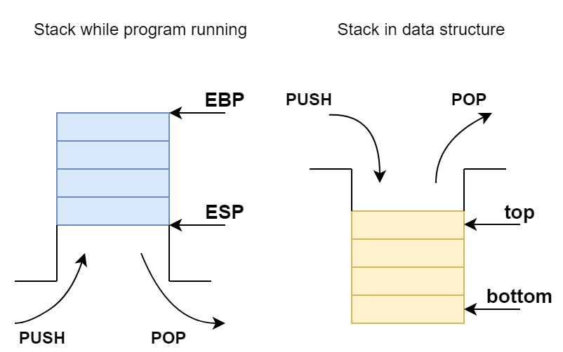

# Stack & Queue

# Stack ADT

​	The stack is like a buket, the first one is deep down the bottom, the last one is on the top.
​	This structure constrain the insert and delete operate only effect on the top of the stack, an it's linear structure.



## ADT

- Data
  - 0 or multi data element constitute the linear sequence $(a_0, a_1 , … , a_{n-1})$, they’re one to one relationed
- Algorithm
  - `create(s,max_size)`: Init a Stack **s** with max capacity of **max_size**
  - `destroy(s)`: realse the stack **s** storage space
  - `is_empty(s)`: check the stack is empty
  - `is_full(s)`: check the stack is full
  - `top(s,x)`: get the top element in stack **s**,return it in **x**
  - `push(s,x)`: insert the element **x** to the top of **s**
  - `pop(s)`: pop out the top element in **s**
  - `clear(s)`: wipe out the data in stack **s**, but not delete data

## sequence stack

it's easy to define the data structure

```c
typedef struct stack
{
    int top;
    int max_size;
    element_type *element;
};
```

the **top** is top element in stack, which can be see as $a_i$

### create

`create(s,max_size)`

Init a Stack **s** with max capacity of **max_size**

```c
status create(stack *s, int max_size){
    s->max_size = max_size;
    s->top = -1; //not a_0, but defore a_0
    s->element = (element_type*)malloc(max_size*sizeof(element_type));
    if(!s->element)
        return ERROR;
    return OK;
}
```

### destroy

`destroy(s)`

realse the stack **s** storage space

```c
status destroy(stack *s){
    s->max_size = 0;
    s->top = -1;
    free(s->element);
    s->element = 0;
}
```

### top

`top(s,x)`

get the top element in stack **s**,return it in **x**

```c
status top(stack *s,  element_type *x){
    if(is_empty)
        return ERROR;
    *x = s->element[s->top];
    return OK;
}
```

### push

`push(s,x)`

insert the element **x** to the top of **s**

```c
status push(stack *s, element_type x){
    if (is_full(s))
        return ERROR;
    s->element[s->top++] = x;
    return OK;
}
```

### pop

`pop(s)`

pop out the top element in **s**

```c
status pop(stack *s){
    if(is_empty(s))
        return ERROR;
    s->element[s->top] = (element_type)0;
    s->top--;
    return OK;
}
```

### clear

`clear(s)`

wipe out the data in stack **s**, but not delete data

```c
void clear(stack *s){
    s->top=-1;
}
```

### Test

```c
#include <stdio.h>
#include <stdlib.h>
#include "stack.h"

int main(){
    stack *s = (stack *)malloc(sizeof(stack));
    create(s,10);
    for (size_t i = 0; i < 10; i++)
        push(s,i);
    for (size_t i = 0; i < 5; i++)
    {
        printf("**loop No.%d\n",i);
        for (size_t j = 0; j < s->top; j++)
            printf("-------No.%d is %d\n",j,s->element[j]);
        pop(s);
    }
    clear(s);
    printf("elements number: %d\n",s->top);
    destroy(s);
    return 0;
}
```

