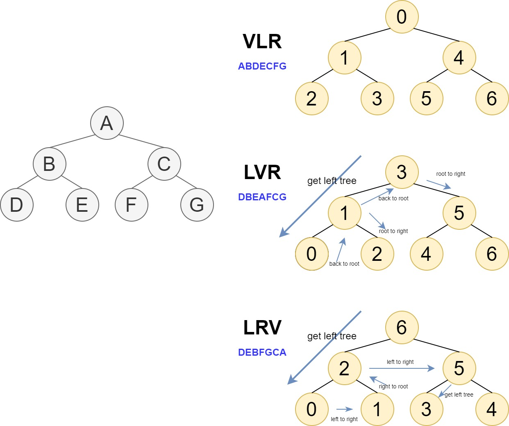
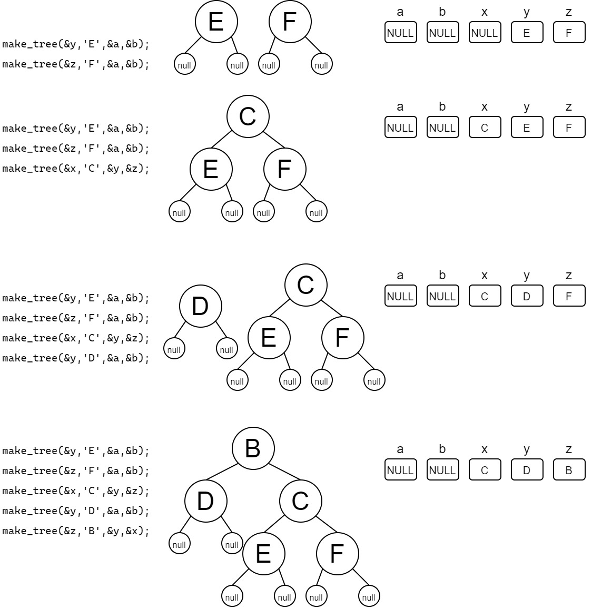
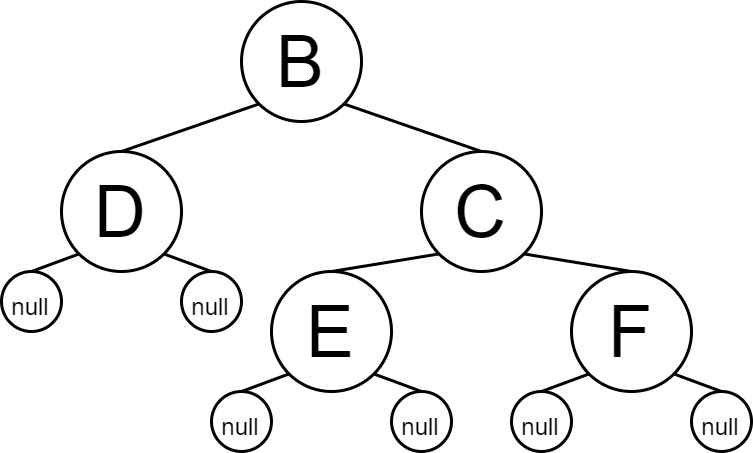
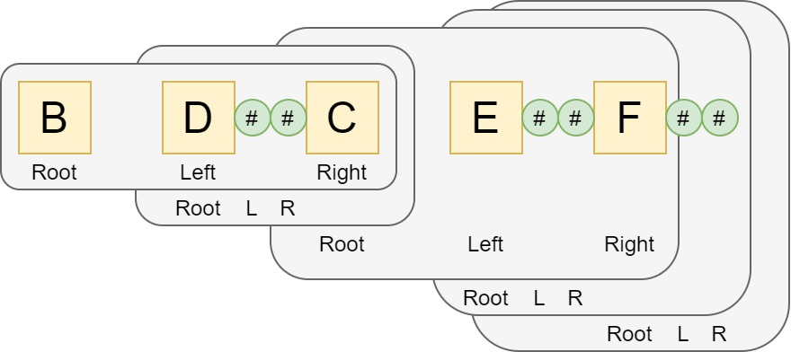
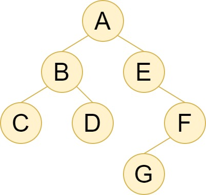
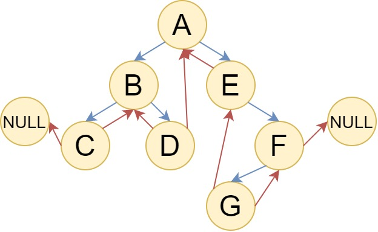
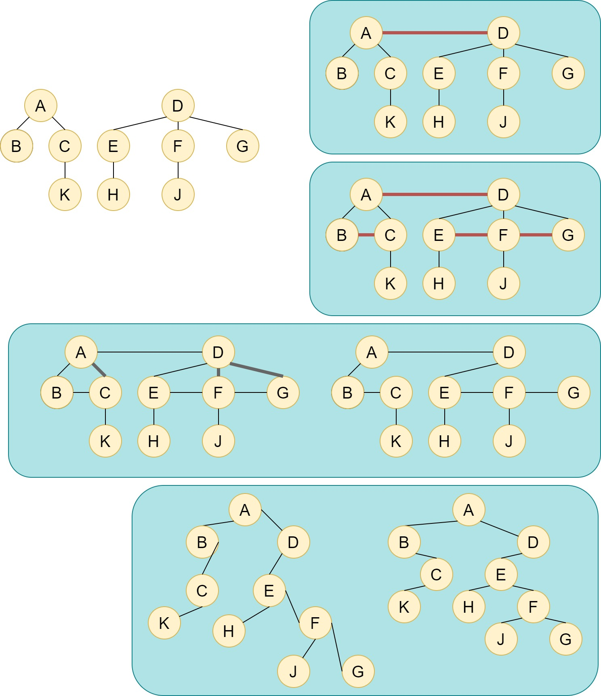
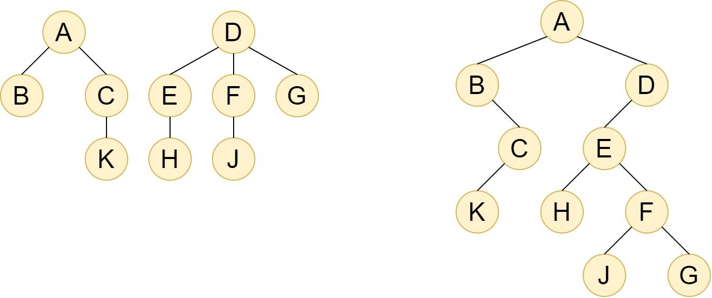
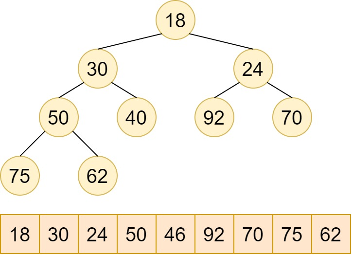

# 数和二叉树

> This chapter contains lots of definations and very complex concepts
>
> So this README file is in Chinese(my native laguage), there will be english version few months later

# 树

## 定义

包括$n$个节点的有限集合$D$，$R$是$D$中元素构成的序偶集合

- 每个节点都只有有限个子节点或无子节点；
- 没有父节点的节点称为根节点；
- 每一个非根节点有且只有一个父节点；
- 除了根节点外，每个子节点可以分为多个不相交的子树；
- 树里面没有环路(cycle)

## 术语

1. **节点的度**：一个节点含有的子树的个数称为该节点的度；
2. **树的度**：一棵树中，最大的节点度称为树的度；
3. **叶节点**或**终端节点**：度为零的节点；
4. **非终端节点**或**分支节点**：度不为零的节点；
5. **父亲节点**或**父节点**：若一个节点含有子节点，则这个节点称为其子节点的父节点；
6. **孩子节点**或**子节点**：一个节点含有的子树的根节点称为该节点的子节点；
7. **兄弟节点**：具有相同父节点的节点互称为兄弟节点；
8. 节点的**层次**：从根开始定义起，根为第1层，根的子节点为第2层，以此类推；
9. **深度**：对于任意节点n,n的深度为从根到n的唯一路径长，根的深度为0；
10. **高度**：对于任意节点n,n的高度为从n到一片树叶的最长路径长，所有树叶的高度为0；
11. **堂兄弟节点**：父节点在同一层的节点互为堂兄弟；
12. **节点的祖先**：从根到该节点所经分支上的所有节点；
13. **子孙**：以某节点为根的子树中任一节点都称为该节点的子孙。
14. **森林**：由m（m>=0）棵互不相交的树的集合称为森林；

# 二叉树

就是度小于2的树

## 性质

- 第 $i$ 层最多有 $2^{i-1}$ 个节点

- 高度为 $h$ 的二叉树最多有 $2^h-1$ 个节点

- 包含 $n$ 个节点的二叉树高度至少为 $log_2{n+1}$，最多为 $n$

- 任意一棵二叉树中，叶子节点数目为 $n_0$ ，度为 $2$ 的节点数为 $n_2$ ，则 $n_0=n_2+1$

  证明：

  ​	设二叉树共有 $n$ 个节点，度为1的节点数为 $n_1$ 。
  二叉树中仅仅只有度为$0,1,2$的节点，所以 $n=n_0+n_1+n_2$

  ​	设该二叉树共有 $B$ 条边，除了根节点其他至少有1条边，得到 $B=n-1$ ,$B=n_1+2n_2$
  三式可得: $n_0=n_2+1$

- 如果高度为 $h$ 的二叉树有 $2^h-1$ 个节点称为 **满二叉树**

- 二叉树只有最小面两层叶节点度小于2，最下层节点集中在靠左的若干位置上，这样二叉树就为**完全二叉树**

- 不存在度为1的树叫做 **2-数**

- 具有 $n$ 个节点的完全二叉树的高度为 $[log_2(n+1)]$

  对于完全二叉树的前 $h-1$ 层为满二叉树，有 $2^{h-1}-1$ 个节点
  最下层最多有节点个数不超过 $2^{h-1}$

  - $2^{h-1} \lt n \le 2^{h-1}-1$
  - $h-1 \lt log_2(n+1) \le h$

  所以 $h$ 是不小于 $log_2(n+1)$ 的最小整数

## ADT

- 数据

  节点的有限集合，要么为空，要么为一个根节点个两个子节点，两个子节点也是二叉树

- 算法

  `create(bt)`: 构造一棵空二叉树bt。
  `new_node(x，ln，rn)`: 创建一个新结点，该结点的值为x，ln和rn为该结点的左右孩子结点。
  `IsEmpty(bt)`:若二叉树bt为空，则返回TRUE，否则返回FALSE。
  `tree_clear(bt)`:清除二叉树bt中的所有结点，使之成为空二叉树。
  `root(bt，x)`:若二叉树bt非空，则用x返回其根结点的值，并返回TRUE，否则返回FALSE。
  `make_tree(bt，x，left，right)`:构造一棵二叉树bt，根结点的值为x，以left和right为该根结点的左右子树。`preorder_tree(bt)`: 先序遍历二叉树bt。
  `inorder_tree(bt)`: 中序遍历二叉树bt。
  `postOrder_tree(bt)`: 后序遍历二叉树bt。
  `levelorder_tree(bt)`: 层次遍历二叉树bt。

**节点结构体**

```c
typedef struct bt_node
{
    element_type element;
    struct bt_node *l_child;
    struct bt_node *r_child;
    
}bt_node;
```

**树结构体**

### create

`create(bt)`: 构造一棵空二叉树bt

```c
void create(bin_tree * bt){
    bt->root = NULL;
}
```

### new_node

`new_node(x，ln，rn)`: 创建一个新结点，该结点的值为x，ln和rn为该结点的左右孩子结点。

```c
bt_node *new_node(element_type x, bt_node *ln, bt_node *rn){
    bt_node *p = (bt_node *)malloc(sizeof(bt_node));
    p->element = x;
    p->l_child = ln;
    p->r_child = rn;
    return p;
}
```

### is_empty

`is_empty(bt)`:若二叉树bt为空，则返回TRUE，否则返回FALSE。

```c
BOOL is_empty(bin_tree *bt){
    if(bt->root == NULL)
        return true;
    return false;
}
```

### root

`root(bt，x)`:若二叉树bt非空，则用x返回其根结点的值，并返回TRUE，否则返回FALSE。

```c
BOOL root(bin_tree *bt, element_type *x){
    if (bt->root)
    {
        *x = bt->root->element;
        return true;
    }
    return false;
}
```

### make_tree

`make_tree(bt，x，left，right)`:构造一棵二叉树bt，根结点的值为x，以left和right为该根结的左右子树。

```c
void make_tree(bin_tree *bt, element_type e, bin_tree *ln, bin_tree *rn){
    if(bt->root || ln == rn)
        return;
    bt->root = new_node(e, ln->root, rn->root);
    ln->root = rn->root = NULL;
}
```

# 二叉树遍历

要实现的功能

`preorder_tree(bt)`: 先序遍历二叉树bt。
`inorder_tree(bt)`: 中序遍历二叉树bt。
`postOrder_tree(bt)`: 后序遍历二叉树bt。
`levelorder_tree(bt)`: 层次遍历二叉树bt。

## 递归遍历

既然每个子节点都是一个树，那为什么不用递归去遍历呢？

先不考虑二叉树为空的情况，有以下的递归遍历方法

- **先序遍历(VLR)**

  根节点 -> 先序遍历(左子树) -> 先序遍历(右子树)

- **中序遍历(LVR)**

  中序遍历(左子树) -> 根节点 -> 中序遍历(右子树)

- **后序遍历(LRV)**

  后序遍历(左子树) -> 后序遍历(右子树) -> 根节点



尝试用递归的思想理解

### 先序遍历

`preorder_tree(bt)`: 先序遍历二叉树bt。

```c
void preorder_tree(bin_tree *bt){
    preorde(bt);
}
//VLR
void preorder(bt_node *bn){
    if (!bn)
        return;
    printf("%c",bn->element);
    printf("%c",preorde(bn->l_child));
    printf("%c",preorde(bn->r_child));
}
```

### 中序遍历

`inorder_tree(bt)`: 中序遍历二叉树bt。

```c
//VLR
void preorder_tree(bin_tree *bt){
    preorder(bt->root);
}
void preorder(bt_node *bn){
    if (!bn)
        return;
    printf("%c ",bn->element);
    preorder(bn->l_child);
    preorder(bn->r_child);
}

//LVR
void inorder_tree(bin_tree *bt){
    inorder(bt->root);
}
void inorder(bt_node *bn){
    if (!bn)
        return;
    inorder(bn->l_child);
    printf("%c ",bn->element);
    inorder(bn->r_child);
}
```

### 后序遍历

`postOrder_tree(bt)`: 后序遍历二叉树bt。

```c
//LVR
void inorder_tree(bin_tree *bt){
    inorder(bt->root);
}
void inorder(bt_node *bn){
    if (!bn)
        return;
    inorder(bn->l_child);
    printf("%c ",bn->element);
    inorder(bn->r_child);
}
```

### 小测试

注意：我们还没有写回收函数，只能让程序退出时操作系统回收内存，但是这里仅仅只验证遍历算法是否正确

1. 构建二叉树

   ```c
       bin_tree a,b,x,y,z;
       create(&a);
       create(&b);
       create(&x);
       create(&y);
       create(&z);
   
       make_tree(&y,'E',&a,&b);
       make_tree(&z,'F',&a,&b);
       make_tree(&x,'C',&y,&z);
       make_tree(&y,'D',&a,&b);
       make_tree(&z,'B',&y,&x);
   ```

   虽然这里`bin_tree`都是保存在栈上面的，但是

   `make_tree`调用的`new_node`节点是使用的`malloc`函数分配的，所以节点的链接是不会改变的

   ```c
   bt_node *new_node(element_type x, bt_node *ln, bt_node *rn){
       bt_node *p = (bt_node *)malloc(sizeof(bt_node));
       p->element = x;
       p->l_child = ln;
       p->r_child = rn;
       return p;
   }
   ```

   关于调用过程

   

2. 遍历二叉树

   ```c
       printf("preorder: ");
       preorder_tree(&z);
   
       printf("\ninorder: ");
       inorder_tree(&z);
   
       printf("\npostorder: ");
       postorder_tree(&z);
       printf("\n");
   ```

   那么

   - 先序遍历：BDCEF
   - 中序遍历：DBECF
   - 后序遍历：DEFCB

   结果

   ```
   preorder: B D C E F
   inorder: D B E C F
   postorder: D E F C B
   ```

   发现没有问题

### 层次遍历

每次从左到右访问该二叉树的元素，上面的例子使用层次遍历的话就为:`BDCEF`

1. 若二叉树为空，退出；初始化队列Q，根节点入队
2. 队列不为空：
   1. 获取队列头中的节点`p`，将头元素出队
   2. 访问节点`p`中元素
   3. 若左节点存在，左节点进队
   4. 若右节点存在，右节点进队
3. 退出

`levelorder_tree(bt)`: 层次遍历二叉树bt。

```c
void level_order_tree(bin_tree *bt){
    if (!bt->root)
        return;
    queue q;
    create_q(&q,100);
    bt_node *bn;
    en_queue(&q, bt->root);

    while(!is_q_empty(&q))
    {
        
        front(&q,bn);
        de_queue(&q);
        int i;
        printf("%c ",bn->element);
        if(bn->l_child)
            en_queue(&q,bn->l_child);
        if(bn->r_child)
            en_queue(&q,bn->r_child);
    }
    destroy(&q);
}
```

## 遍历的应用

### 计算二叉树节点的个数

使用任意一种方式，存在则总数+1，也可递归使用`size(bin_tree)`函数

```c
int tree_size(bin_tree *bt){
    return size(bt->root);
}
int size(bt_node *bn){
    if (!bn)
        return 0;
    return size(bn->l_child)+size(bn->r_child)+1;
}
```

### 清空二叉树

```c
void tree_clear(bin_tree *bt){
    tclear(bt->root);
    bt->root=NULL;
}

void tclear(bt_node *bn){
    if(!bn)
        return;
    tclear(bn->l_child);
    tclear(bn->r_child);
    free(bn);
}
```

### 先序构建二叉树

之前的二叉树



先序遍历的顺序是：**B D C E F**。那么如何反向构建一颗二叉树？

为了区别叶子节点，叶子结点的两个子节点均为NULL，使用`#`表示，那么上面的顺序就为`BD##CE##F##`


```c
bt_node *pre_create(bt_node *bn){
    char ch;
    ch=getchar();
    if(ch=='#')
        bn=NULL; //create null node
    else
    {
        bn = (bt_node*)malloc(sizeof(bt_node));
        bn->element = ch;
        bn->l_child=pre_create(bn->l_child);
        bn->r_child=pre_create(bn->r_child);
    }
    printf("pre_creating\n");
    return bn;
}
void pre_make(bin_tree *bt){
    bt->root=pre_create(bt->root);
    printf("pre_make\n");
}
```

使用递归同样可以做到交换左右子树、求二叉树高度等

## 非递归遍历

递归其实是一种非常浪费空间的方法，递归深度过高会导致内存耗尽。所以一般希望使用它的迭代版本

二叉树作为一种非线性结构，在进行递归访问的时候我们利用程序的栈来实现对另外一侧节点的访问。如果我们想要线性地、能迭代的访问二叉树就不洗自己实现这种功能，这种保存的信息叫做“线索”，这样就可以定义一颗线索二叉树了。

不过这里不用线索二叉树，大致讲下思路

很明显为了保存这些信息我们需要一个堆栈`s`保存待访问的节点

对该二叉树



- 先序遍历(VLR)

  ```fake_python
  s=stack()
  p=root
  s.push(p)
  while(p!=NULL or !is_empty(s)):
  	print(s.top->value)
  	s.pop()
  	if p->rchild:
  		s.push(p->rchild)
  	elif ->lchild:
  		s.push(p->lchild)
  ```

- 中序遍历(LVR)

  ```fake_python
  s=stack()
  p=root
  s.push(p)
  p=p->left
  while(p!=NULL or !is_empty(s)):
  	while(p):
  		s.push(p) #此处可以让右节点入栈
  		p=p->lchild
  	print(s.top()->value)
  	p=s.top()
  	s.pop()
  	p=p->rchild
  ```

  回溯的时候右节点入栈

- 后序遍历(LRV)

  ```fake_python
  s=stack()
  p=root
  while(p!=NULL or !is_empty(s)):
  	while(p):
  		s.push(p)
  		if(p->lchild): p = p->lchild
  		elif(p->rchild): p = p->rchild
  	print(s.top())
  	p = s.top()
      s.pop()
  	if s and s.top()->lchild == p:
  		p = p->rchild
  	else:
  		p = NULL  
  ```

  若为左节点，则右节点入栈

  若为右节点，返回上一层

**注：**如果使用C多文件编译时，头文件相互应用关系可以将其中一个设置为指针，然后再对应`.c`文件实现功能时强制转换到对应数据结构，可以参考`t_stack.h/.c` `t_queue.h/.c` `tree.h` `bin_tree.c` `tree.c`

## 线索二叉树

### 构建

叶子结点的指针空余带来的是很多没有被利用的空间


- **Ltag**
  - **0**: `lchild`指向左节点
  - **1**: `lchild`指向该节点的遍历前驱

- **Rtag**
  - **0**: `rchild`指向左节点
  - **1**: `rchild`指向该节点的遍历后继

最后就可以按照遍历方式得到一个链表，依次访问该链表就是该遍历方式的遍历顺序


上图的中序遍历就是：CBDAEGF

对应的中序穿线树为




### 遍历

#### 中序

使用python伪代码

```fake_python
//中序遍历
p=root
while p->lchild:
	p = p->lchild
while p:
	print(p)
	if(p->rtag==0 and p->rchild): #不是线索
		p = p->rchild
        while(p->lchild):
            p = p->lchild
	else: p = p->rchild
```

跟着步骤得到遍历顺序: CBDAEGF
这里只得到了中序遍历的结果

#### 先序

```fake_python
p=root
while(p):
	print(p->value)
	if p->lchild and p->ltag == 0: #不为线索
		p = p->lchild
	else:
		p = p->rchild
```

#### 后序（有点难）

后续比较特殊的是由于遍历不能存储之前的信息，所以后序穿线树多了一个叫做`parent`的指针指向父节点

```fake_python
p = root
pre_node=NULL
while(p):
	while(p->lchild and p->ltag == 0): #到最左节点
		p = p->lchild
	while(p->rchild and p->rtag == 1): #右节点为线索
		print(p->value)
		pre_node = p
		p = p->rchild
	while(p and p->rchild == pre_node): #类似回路判断
										#则返回到父节点
		print(p->value)
		prev_node = p
		p=p->parent
	if(node and node->rtag == 0): #进入右子树遍历
		p = p->rchild
```

# 树和森林

## 森林与二叉树转换

### 森林转二叉树

1. 根结点相连
2. 兄弟关系的节点相连
3. 去掉从双亲到除了第一个孩子以外的连线
4. 一点点的倾斜



### 二叉树转森林

基本就是逆转

1. 对 **P** 左节点的右节点存在，即`P->lchild->rchild!=NULL`，则 **P** 和`P->lchild->rchild`相连，也和`P->lchild->rchild->rchild->...`相连
2. 删除原有二叉树中的右节点关系
3. 得到森林


## 树和森林的存储表示

**多重链表法**

就是一个节点有多个指针只想子节点，虽然比较直观，但是空间浪费严重，

**孩子兄弟表示法**

就是将树或者森林变成二叉树，然后就是用二叉树的方式表示

| child | node_data | node_sibling |
| ----- | --------- | ------------ |
|       |           |              |

**双亲表示法**

从叶节点指向父节点，最后使用线性表格存储

| node_index | node_data | node_parent_index |
| ---------- | --------- | ----------------- |
|            |           |                   |

**三重链表表示法**

 相当 **双亲表示法** + **孩子兄弟表示法**，每个节点如下，只多了一个指向`parent`节点的指针，这样方便从字节带你找到父节点，也能从父节点找到子节点

| child | child | node_data | parent |
| ----- | ----- | --------- | ------ |
|       |       |           |        |

**带右链的x序表示法**

既然三重链表表示法是方法的叠加，那么我们也可以从 森林/树->二叉树->x序二叉树，而且二叉树还森林原操作都是针对右节点操作，所以按照x序遍历过后指针都是向右指的，比如（其中`l_tag`表示当前节点是有左子节点，为0表示有，1表示无）

这里以带右链的中序表示法为例



| sibling     | 4    | 2    | -1   | -1   | -1   | 7    | -1   | 9    | -1   | -1   |
| ----------- | ---- | ---- | ---- | ---- | ---- | ---- | ---- | ---- | ---- | ---- |
| **element** | A    | B    | C    | K    | D    | E    | H    | F    | J    | G    |
| **l_tag**   | 0    | 1    | 0    | 1    | 0    | 0    | 1    | 0    | 1    | 1    |
| **index**   | 0    | 1    | 2    | 3    | 4    | 5    | 6    | 7    | 8    | 9    |

## 树和森林遍历

### 深度遍历

对应的是递归三种遍历：先序、中序、后序

### 宽度遍历

对应的是层次遍历

# 堆和优先权队列

​	有一种数据结构，元素加入的次序无所谓，但是元素之前有取出的优先权，每次出去都是优先权最高的元素。
​	很容易想到队列，因为如果入队时间越早，优先权越高，优先权自然越高，而出队也最方便

​	问题就是使用队列每次插入新的值会执行线性搜索，会增加复杂度

## 关于堆

就是一颗**完全二叉树**，根节点叫做堆顶，由子节点和父节点的关系分为

- **最小堆**：父节点小于或等于子节点
- **最小堆**：父节点大于或等于子节点，父节点存储最大值

## 建堆运算

以建立最小堆位例子，比如有



上面的序列就是一个很好的输入序列，但是我们输入是无序的，所以需要调整位置

虽然逻辑结构上是树，但是存储上是线性表存储，也就是说我们可以通过数组下表计算的方式调整堆

最小堆这里有特性：$lchild \ge rchild \ge root$
那么只需要从上往下，从左子树开始比较后，然后置换对应的节点，最后扫描的为叶子节点就算调整完毕 **注意，这里是完全二叉树，计算下标很简单**

```c
void adjust_down(element_type heap[], int cur, int boder){
    int p = cur;
    int min_child;
    element_type tmp;

    while(2*p+1 <= boder){
        if ((2*p+2 <= boder) && (heap[2*p+1]>heap[2*p+2]))
            min_child = 2*p+2;
        else
            min_child = 2*p+1;
        if(heap[p]<=heap[min_child])
            break;
        else{
            tmp = heap[p];
            heap[p]=heap[min_child];
            heap[min_child]=tmp;
            /* If it's int type*/
            //heap[p]=heap[min_child]^0x10
            //heap[min_child]=heap[p]^0x10
            p=min_child;
        }
    }
}
```

那么为了在建立堆的时候

```c
void create_heap(element_type heap[], int n){
    int i;
    for(i=(n-2)/2; i>=0; i--)
        adjust_down(heap,i,n-1);
}
```

## 优先权队列

**这里依然以最小堆位例子**

### ADT

- **data**

  $n \ge 0$的最小堆

- **algorithm**

  `prior_create(pq, max_size)`: create a empty prirorityQueue

  `priro_destroy(pq)`: realese memroy space

  `priro_is_empty(pq)`:

  `priro_is_full(pq)`:

  `priro_size(pq)`: get the element number

  `priro_append(pq,x)`: add new element `x` into prirority queue `pq`

  `priro_serve(pq,x)`: set `x` to the highest prirority element in `pq`

和队列差不多的结构体

```c
typedef char t_element_type;
struct priro_q
{
    t_element_type *pq;
    int n;
    int max_size;
}priro_q;
```

### 向上调整算法

​	由于每次添加元素到队列，都是添加到堆底，如果下一个出现元素打破队列，就需要调整下标了
​	根据堆的特性，出现这种情况就是当先优先级小于父节点，那么循环比较直到根节点就可以了

```c
/**
 *          heap[(p-1)/2]                heap[(p-1)/2]
 *      heap[p]   heap[p+1]   or  heap[p-1]      heap[p]
 */
void adjust_up(element_type heap[], int cur){
    int p =cur;
    element_type tmp;
    while(p>0){
        if(heap[p]<heap[(p-1)/2]){
            tmp = heap[p];
            heap[p]=heap[(p-1)/2];
            heap[(p-1)/2]=tmp;
            /* or t_elemtn_type is int*/
            // heap[(p-1)/2]=heap[p]^0x10
            // heap[p]=heap[(p-1)/2]^0x10
            p=(p-1)/2;
        }
        else
            break;
    }
}
```

### prior_create

`prior_create(pq, max_size)`create a empty prirorityQueue

```c
void prior_q_create(prior_q *pq,int max_size){
    pq->max_size = max_size;
    pq->n = 0;
    pq->q = (element_type *)malloc(max_size*sizeof(element_type));
    memset(pq->q,0,pq->max_size*sizeof(element_type));
}
```

### priro_destroy

`priro_destroy(pq)`: realese memroy space

```c
void prior_q_destroy(prior_q *pq){
    free(pq->q);
    pq->n=0;
    pq->max_size=0;
}
```

### priro_append

`priro_append(pq,x)`: add new element `x` into prirority queue `pq`

```c
void prior_q_append(prior_q *pq, element_type x){
    if( prior_q_is_full(pq) ) return;
    pq->q[pq->n]=x;
    pq->n++;
    adjust_up(pq->q, pq->n-1);
}
```

### priro_serve

`priro_serve(pq,x)`: set `x` to the highest prirority element in `pq`

```c
void priro_q_serve(prior_q *pq, element_type *x){
    if(prior_q_is_empty(pq)) return;
    *x = pq->q[0];
    pq->n--;
    pq->q[0]=pq->q[pq->n];
    adjust_down(pq->q, 0, pq->n-1);
}
```

### main

```c
#include <ADT/priority_queue.h>
#include <stdio.h>
#include <stdlib.h>

int main()
{
    prior_q *pq=malloc(sizeof(prior_q));
    prior_q_create(pq,10);
    int test_case[]={71,74,2,72,54,93,52,28,'\0'};
    int i;
    
    for (i = 0; test_case[i]; i++)
        prior_q_append(pq, test_case[i]);
    while(pq->n>0){
        element_type x;
        priro_q_serve(pq,&x);
        printf("%d ",x);
    }
    return 0;
}
```

output

```
2 28 52 54 71 72 74 93 
```

# 哈夫曼树和哈夫曼编码

