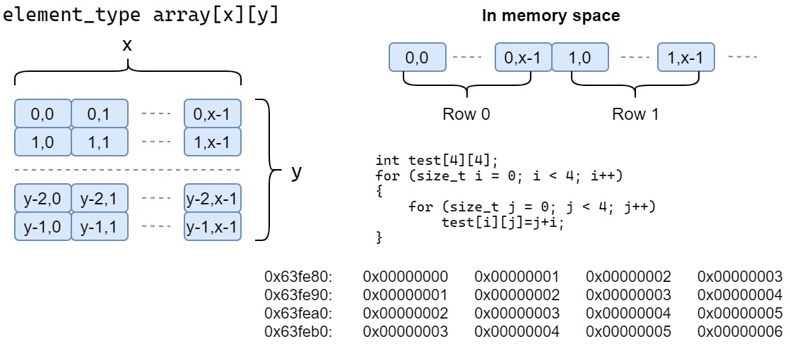
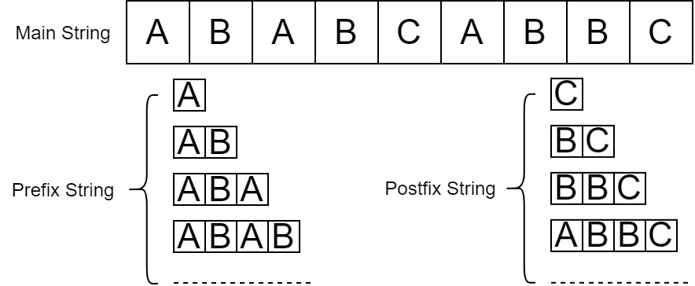
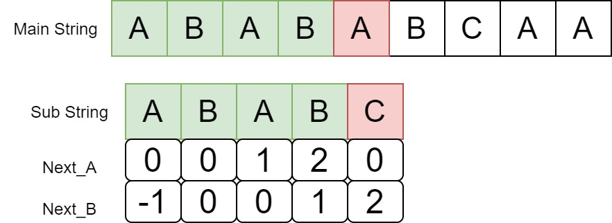

# Array & String

# Array

## Array

​	Array is continuous continuous storage data type, usually used in sequencly storage data.Because of each element have the same size,so it can use index to find the data.

​	One-dimensional array is most simple array is c programming.

​	Two-dimensional array always define in `element_type array[x][y]`


​	Assum $array[4][]4$,so if we kown the $array[0][0]$ address is $63FE80$, element size is $4$, the address of $array[1][2]$ is $63FE80+(1\times4+2)\times 4 = 63FE98$

​	If it's multi-dimensional array like $array[m_1][m_2]...[m_n]$, the location of $array[i_1][i_2]...[i_n]$ could be: $location(arr[0]...[0])+(i_1\times m_2 \times ... \times m_n+i_2\times m_3 \times ... \times m_n+...i_n)\times element\_size$

### ADT

- Data

  the sets of index $<i_1,i_2,...,i_n>$ 
  the sets of value and index, like $<i,v>$

  the length of each dimension is $m_1,m_2,...,m_n$

- Algorithm

  `create_array(A,m_1,m_2,...,m_n)`: allocate n-dimensional array needed space

  `destroy(A)`: destroy n-dimensional array A

  `retrieve_array(A,i_1,i_2,...,i_n)`: check the element existes, if it is, check the bounary and return the value

  `store_array(A,i_1,i_2,...,i_n,x)`: set the element value to x

  `output(A)`: output all element

  `copy_array(A,B)`: if arrayA and arrayB both have the same size, copy element in A to B;

### Triple Array

```c
typedef struct triple_array
{
    int m1;
    int m2;
    int m3;
    int *array;
}triple_array;
```

### create_array

`create_array(A,m_1,m_2,...,m_n)`

allocate n-dimensional array needed space

```c
status create_array(triple_array *tri_a, int m1, int m2, int m3){
    tri_a->m1 = m1;
    tri_a->m2 = m2;
    tri_a->m3 = m3;
    tri_a->array = (int *)malloc(sizeof(int)*m1*m2*m3);
    if(!tri_a->array)
        return ERROR;
    return OK;
}
```

### destroy

`destroy(A)`

destroy n-dimensional array A

```c
status destroy(triple_array *tri_a){
    if(!tri_a)
        return ERROR;
    if(tri_a->array)
        free(tri_a->array);
    return OK;
}
```

### retrieve_array

`retrieve_array(A,i_1,i_2,...,i_n)`

check the element existes, if it is, check the bounary and return the value

here used the equation mentioned before

```c
status retrieve_array(triple_array *tri_a, int i1, int i2, int i3, int *x){
    if(!tri_a->array)
        return ERROR;
    //check the boundary
    if (i1>tri_a->m1 || i2>tri_a->m2 || i3>tri_a->m3||
        i1<0 || i2<0 || i3<0)
        return ERROR;
    // *x = tri_a->array[m1][m2][m3];
    *x = *((tri_a->array)+sizeof(int)*
    (i1*tri_a->m2*tri_a->m3+i2*tri_a->m3+i3));
    return OK;
}
```

### store_array

`store_array(A,i_1,i_2,...,i_n,x)`

set the element value to x

```c
status store_array(triple_array *tri_a, int i1, int i2, int i3, int x){
    if(!tri_a->array)
        return ERROR;
    //check the boundary
    if (i1>tri_a->m1 || i2>tri_a->m2 || i3>tri_a->m3||
        i1<0 || i2<0 || i3<0)
        return ERROR;
    // tri_a->array[m1][m2][m3]=x;
    *((tri_a->array)+sizeof(int)*
    (i1*tri_a->m2*tri_a->m3+i2*tri_a->m3+i3)) = x;
    return OK;    
}
```

### output

```c
status output(triple_array *tri_a){
    int i1,i2,i3;
    if(!tri_a->array)
        return ERROR;
    for (size_t i = 0; i < tri_a->m1; i++)
        for (size_t j = 0; j < tri_a->m2; j++)
            for (size_t k = 0; k < tri_a->m3; k++)
            {
                int value;
                retrieve_array(tri_a,i,j,k,&value);
                printf("array[%d][%d][%d] = %d\n",
                    i,j,k,value);
            }
    return OK;
    
}
```

### copy_array

`copy_array(A,B)`

if arrayA and arrayB both have the same size, copy element in A to B;

```c
status copy_array(triple_array *A,triple_array *B){
    if(!A->array || !B->array)
        return ERROR;
    if(A->array == B->array)
        return ERROR;
    if(A->m1!=B->m1 || A->m2!=B->m2 || A->m3!=B->m3)
        return ERROR;
    for (size_t i = 0; i < A->m1; i++)
        for (size_t j = 0; j < A->m2; j++)
            for (size_t k = 0; k < A->m3; k++)
            {
                // B->array[i][j][k] = A->array[i][j][k];
                int value;
                retrieve_array(A,i,j,k,&value);
                store_array(B,i,j,k,value);
            }
    return OK;
}
```

### main

```c
#include "array.h"
#include <stdio.h>
#include <stdlib.h>

int main()
{
    triple_array *A = (triple_array*)malloc(sizeof(triple_array));
    triple_array *B = (triple_array*)malloc(sizeof(triple_array));
    create_array(A,2,2,2);
    create_array(B,2,2,2);
    for (int i = 0; i < A->m1; i++)
        for (int j = 0; j < A->m2; j++)
            for (int k = 0; k < A->m3; k++)
            {
                store_array(A,i,j,k,10);
                store_array(B,i,j,k,5);
            }
    printf("--------------Now Output A\n");
    output(A);
    printf("--------------Now Output B\n");
    output(B);

    copy_array(A,B);
    printf("\n");
    printf("\n");
    printf("\n");

    printf("--------------Now Output A\n");
    output(A);
    printf("--------------Now Output B\n");
    output(B);

    destroy(A);
    destroy(B);
    free(A);
    free(B);

    return 0;
}
```

## Maxtri

### sparse maxtrix ADT

- Data

  matrix most element value is 0

- Algorithm

  `create_sparse_matrix(A, m, n)`: create an empty sparse matrix

  `clear_sparse_matrix(A)`: wipe data in maxtrix

  `store_sparse_matrix_item(A,i,j,x)`: set `matrix[i][j]=x`

  `retrieve_sparse_matrix(A,i,j)`: get the `matrix[i][j]` value

  `output_sparse_matrix(A)`

  `transpose_sparse_matrix(A)`: transpose the matrix A

  `add_spares_matrix(A,B)`: $A=A+B$

  `multi_sparse_matrix(A,B)`: $A=A*B$

### algorithm design

​	Because sparse matrix has tons of junk data 0, in order to saving space, we can store the data which is not 0 in a sheet, the sheet contained $<row number, column number,value>$ each line. The pirority could be row-first or column-first.

​	If a sparse matrix like

$ \begin{bmatrix} -5&-2&0&0&0&0 \\\\ 0&0&0&-6&0&0 \\\\ 0&0&0&0&0&0\\\\ 0&-3&0&0&0&0\\\\ -7&0&0&-4&0&0\\\\ 0&0&-1&0&0&0 \end{bmatrix} $

the row-first Triad be like

|      | i    | j    | $a_{ij}$ |
| ---- | ---- | ---- | -------- |
| 0    | 0    | 0    | -5       |
| 1    | 0    | 1    | -2       |
| 2    | 1    | 3    | -6       |
| 3    | 3    | 1    | -3       |
| 4    | 4    | 0    | -7       |
| 5    | 4    | 3    | -4       |
| 6    | 5    | 2    | -1       |

#### transpose

most common method is

```c
for(int i=0; i<m; i++)
    for(int j=0; i<n; j++)
        B[i][j]=A[j][i]
```

​	but this need scan all element in A, if we transpose an sparse matrix, the junk data 0 caused waste of time.

​	keep this way of thinking, we just need operate data in Triad

​	the fast transpose method need more storage space, but it's $O(n+t)$

- one-dimensional auxiliary array: `k` `num`

  - `num` store the sum of element numbers not equal to 0 in $j$ column

    ```c
    for(int i=0; i<t; i++)
        num[A->table[i].col]++;
    ```

  -  `k[j]` store the sum of not 0 elements in column from $0$ to $j-1$

    ```c
    for(int i=0; i<n; i++)
        k[i]=k[i+1]+num[i-1];
    ```

- auxiliary function

  ```c
  for(int i=0; i<t; i++){
  	int index = l[A->table[i]->col]++;
      B->table[index].col=A->table[i].row;
      B->table[index].row=A->table[i].col;
      B->table[index].value=A->table[i].value;
  }   
  ```

the sparse matrix we take example above, could be like

| j        | 0    | 1    | 2    | 3    | 4    | 5    |
| -------- | ---- | ---- | ---- | ---- | ---- | ---- |
| `num[j]` | 2    | 2    | 1    | 2    | 0    | 0    |
| `k[j]`   | 0    | 2    | 4    | 5    | 7    | 7    |

# String

## ADT

- data

  A string is consists of  specific sequence characters like $a_0a_1a_2...a_n$

- algorithm

  `create_str(s,max_len)`:  create max_len size to storage string s, initial with 0

  `len(s)`: return the length of the string s

  `clear(s)`: set string to an empty string

  `insert(s,p,pos)` : pretty similar to sequence list's insert. Insert `p` to `s[pos]` and other behind move back `len(p)`

  `remove(s,pos,len)`: cut down substring `s[pos:len]`, and the charaters after `s[pos:len]` move front  `len`

  `substring(s,pos,len)`:  return a substring  start in pos with length len

  `index(s, p ,pos)`: jugde if in `s[pos:]` contain substring `p`

so, using C give it a struct

```c
typedef struct mystr
{
    char *str;
    int len,max_len;
};
```

### create

`create_str(s,max_len)`

create max_len size to storage string s, initial with 0

```c
status create(mystr *s,int len){
    s->len = 0;
    s->max_len = len;
    s->str = (char *)malloc(s->max_len);
    if(!s->str)
        return ERROR;
    for (int i = 0; i < s->len; i++)
        s->str[i] = (char)0;
    return OK;
}
```

### len

`len(s)`: return the length of the string `s`

```c
int len(mystr *s){
    int len = 0;
    if(!s->str)
        return ERROR;
    for (int i = 0; s->str[i]; i++)
        len++;
    s->len = len;
    return len;
}
```

### clear

`clear(s)`: set string to an empty string

```c
status clear(mystr *s){
    if(!s->str)
        return ERROR;
    for (int i = 0; i < s->len; i++)
        s->str[i]=(char)0;
    s->len=0;
    return OK;
}
```

### insert

`insert(s,p,pos)` : pretty similar to sequence list's insert. Insert `p` to `s[pos]` and other behind move back `len(p)`

Omit.

### remove

`remove(s,pos,len)`: cut down substring `s[pos:len]`, and the charaters after `s[pos:len]` move front  `len`

Omit.

### substring

`substring(s,pos,len)`:  return a substring  start in pos with length len

Omit.

## string match

`index(s, p ,pos)`: jugde if in `s[pos:]` contain substring `p`

>  推荐：https://www.bilibili.com/video/BV1AY4y157yL

we have main string `s` and substring `p`

### Easiest

```c
int match(mystr *s, mystr *p, int s_start, int p_start, int *s_failed, int *p_failed){
    int i = s_start, j = p_start;
    for (; j < p->len; i++,j++)
    {
        if(s->str[i] != p->str[j])
        {
            *s_failed = i;
            *p_failed = j;
            return ERROR;
        }
    }
    return OK;
}
```

```c
int index(mystr *s, mystr *p, int pos){
    int s_start=pos, p_start=0, s_failed, p_failed;
    for (s_start; s_start <= s->len - p->len ; s_start++)
    {
        if (match(s,p,s_start,p_start,&s_failed,&p_failed))
            return s_start;
    }
    return ABNORMAL;
}
```

But it's not efficient enough, we waste a lot of time to do same compare

### KMP

Highly accomand the video https://www.bilibili.com/video/BV1AY4y157yL

The KMP algorithm is a typically DP(Dynamic Programming) problem, it uses `next` array for saving time.



The max prefix equals postfix's length is **1**

let do match



here: `main[i] != sub[j]` $i=4,j=4$, **Using `Next_B`**

so the characters before the i in main and j in sub is the same

$sub[0]=main[i-j],sub[1]=main[i-j+1]...$

get the substring equation $sub[0,j-1]=main[i-j,i-1]$

but we kown **the longest equal prefix and suffix substring's length** of $sub[0:j-1]$ is `"AB"`,  length $k=2$. so $sub[0]=sub[j-k],sub[1]=sub[j-k+1]$
Take this recursively, $sub[0,k-1]=sub[j-k,j-1]$

-  $sub[0,j-1]=main[i-j,i-1]$

  according they have the same length

  - $sub[0,k-1]=main[i-j,i-j+(k-1)]$
  - $sub[j-k,j-1]=main[i-k,i-1]$

-  $sub[0,k-1]=sub[j-k,j-1]$

finally we would get

$sub[0,k-1]=sub[j-k,j-1]=main[i-k,i-1]$

`sub[0:1]=main[2:3]` (`"AB"=="AB"`)

So we can jump over $j-k$ and continue compare.

Becaues this time the pointer point to main string is always keep forward, it's an $O(n)$ algorithm

How to build `next` array?

if we compare the character, it will be three results:

- `next[0] == -1`, `i = 1` , `prefix_len = 0`
- `patt[prefix_len]==patt[i]`
  - `prefix_len+=1` `i+=1`
  - `next[i]=prefix_len`
- `else`
  - `if prefix_len == 0`
    - `next[i]=0`
    - `i+=1`
  - `else`
    - `prefix_len = next[prefix_len-1]`

#### build next

##### build_nextA

using c would be like

```c
void build_nextA(mystr *p, int next[]){
    next[0]=0;
    int prefix=0,i=1;
    while (i<p->len)
    {
        if (p->str[prefix] == p->str[i])
        {
            prefix++;
            next[i]=prefix;
            i++;
        }
        else
        {
            if (prefix==0)
            {
                next[i]=0;
                i++;
            }
            else
                prefix = next[prefix - 1];
        }   
    }
}
```

##### build_nextB

```c
void build_nextB(mystr *p, int next[]){
    int j = 0, k =-1;
    next[0]=-1;
    while (j < p->len)
    {
        if (k==-1||p->str[j]==p->str[k])
        {
            ++j;++k;
            next[j]=k;
        }
        else
            k=next[k];
    }
}
```


#### build KMP

##### KMP_A

**Finally** time to write a full KMP algorithm

```c
int KMP_A(mystr *s, mystr *p, int next[]){
    int s_start = 0, p_start = 0;
    while (s_start <= s->len)
    {
        if (s->str[s_start]==p->str[p_start])
        {   ++s_start; ++p_start;   }
        else if (p_start > 0)
            p_start = next[p_start -1];
        else
            ++s_start;

        if (p_start == p->len)
            return s_start - p_start;
        
    }   
}
```

##### KMP_B

first define function `match`

```c
int match(mystr *s, mystr *p, int s_start, int p_start, int *s_failed, int *p_failed){
    int i = s_start, j = p_start;
    for (; j < p->len; i++,j++)
    {
        if(s->str[i] != p->str[j])
        {
            *s_failed = i;
            *p_failed = j;
            return ERROR;
        }
    }
    return OK;
}
```

then KMP_B

```c
int KMP_B(mystr *s, mystr *p, int next[]){
    int s_start = 0, p_start = 0, s_failed, p_failed;
    while (s_start <= s->len - p->len)
    {
        if (match(s,p,s_start,p_start, &s_failed, &p_failed))
            return s_start - p_start;
        else
        {
            p_start = next[p_failed];
            s_start = s_failed;
            if(p_start == -1)
            {
                p_start = 0;
                s_start++;
            }
        }
        
    }
    return ABNORMAL;
}
```

#### test funtion

```c
int main(){
    char *main = "ABABABCAA";
    char *sub = "ABABC";

    mystr *s = (mystr *)malloc(sizeof(mystr));
    mystr *p = (mystr *)malloc(sizeof(mystr));
    create(s,strlen(main)+0x10);
    create(p,strlen(sub)+0x10);
    
    strcpy(s->str,main);
    s->len=(strlen(s->str));
    strcpy(p->str,sub);
    p->len=(strlen(p->str));


    printf("mystr S is: %s\n",s->str);
    printf("mystr P is: %s\n",p->str);

    int next[p->len];
    build_nextA(p,next);
    printf("KMP_A: %d\n",KMP_A(s,p,next));
    build_nextB(p,next);
    printf("KMP_B: %d\n",KMP_B(s,p,next));
    printf("index: %d\n",index(s,p,0));
    return 0;
}
```

output

```
mystr S is: ABABABCAA
mystr P is: ABABC    
KMP_A: 2
KMP_B: 2
index: 2
```

