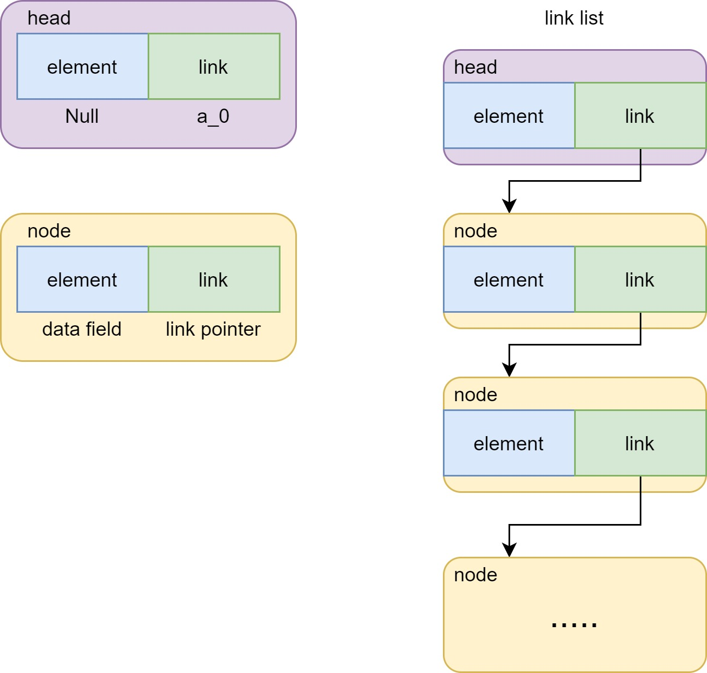
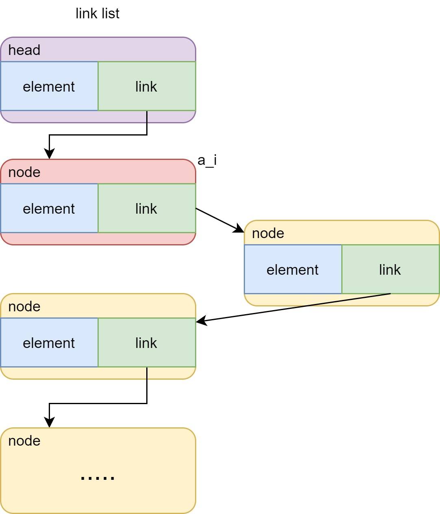
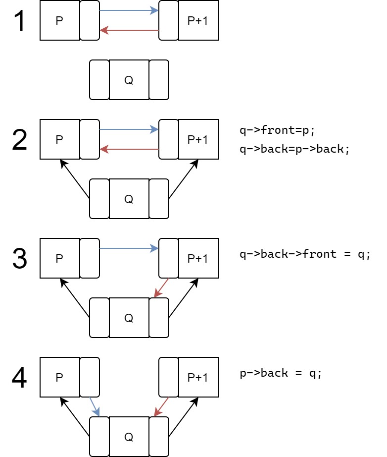

# Linear table

## ADT

 - Data:
    - 0 or multi data element constitute the linear sequence $(a_0, a_1 , ... , a_{n-1})$, they're one to one relationed
 - Algorithm:
    - `Init(list)`:     init a empty list; return OK if it succed, return ERROR if it false
    - `Destroy(list)`:  wipe a list if it existed; return OK if it succed, else return ERROR
    - `IsEmpty(list)`:  judge is lenth empty; return OK if it's empty, return ERROR if it's not
    - `Length(list) `:  get list length; return element numbers if list existed, else return ERROR
    - `Find(list,index)`:  search; if list existed and $0 \le i \le n-1$, return the mem_address of $a_i$; else return ERROR
    - `Insert(list,index,x)`:  if list existed and $0 \le i \le n-1$, insert a new value x after $a_i$; if $i = -1$, sets $a_0$ to new value; after inset return OK, else return ERROR
    - `Delete(list,index)`:  if list is not empty and $0 \le i \le n-1$, delete the element $a_i$, after delete return OK, else return ERROR
    - `Update(list,index,x)`:  if list existed and $0 \le i \le n-1$, change $a_i$ value to x, after update return OK, else return ERROR
    - `Output(list)`:  if list is existed, print the all element in list, else return ERROR

## sequential storage structure

we assume the first value's($a_0$) address in memory is $loc(a_0)$, each element cost $k$ memory space, so the any element $a_i$ in list it addresss is 
$loc(a_i) = loc(a_0) + k \times i$

so we can define a seq_list like

```c
typedef int element_type;

typedef struct seq_list
{
    int n;
    int max_length;
    element_type *elements; //element_type elements[max_length];
} seq_list;
```

### 1.init
`Init(list)`

init a empty list; return OK if it succed, return ERROR if it false

```c
status slist_init(seq_list *L, int m_size){
    L->max_length = m_size;
    L->n = 0;
    L->elements = (element_type *)malloc(sizeof(element_type)*m_size);
    if(L->elements) return OK;
    else return ERROR;
}
```

### 2.destroy

`Destroy(list)`

wipe a list if it existed; return OK if it succed, else return ERROR

```c
status slist_destroy(seq_list *L){
    if (L){
        L->n=0;
        L->max_length=0;
        free(L->elements);
        if (!L) return OK;
    }
    return ERROR;
}
```

### 3.is_empty

`IsEmpty(list)`

judge is the lenth empty; return OK if it's empty, return ERROR if it's not

```c
int slist_length(seq_list *L){
    if (L) return L->n;
    else return (int)ERROR;
}
```

### 4.length

`Length(list) `

get list length; return element numbers if list existed, else return ERROR

```c
int length(seq_list *L){
    if (L) return L->n;
    else return (int)ERROR;
}
```

### 5.find

`Find(list,index)`

search; if list existed and $0 \le i \le n-1$, return the mem_address of $a_i$; else return ERROR

```c
status slist_find(seq_list L, int i, element_type *x){
    if(i<0 || i>L.n-1)
        return ERROR;
    *x = L.elements[i];
    return OK;
}
```

or 

```c
status slist_find(seq_list L, int i, element_type *x){
    if(i<0 || i>L.n-1)
        return ERROR;
    *x = L.elements[i];
    return OK;
}
```

### 6.insert

`Insert(list,index,x)`

if list existed and $0 \le i \le n-1$, insert a new value x after $a_i$; if $i = -1$, sets $a_0$ to new value; after inset return OK, else return ERROR

```c
status slist_insert(seq_list *L, int i, element_type x){
    int j=0;
    if (i< -1 || i> L->n-1)     //1.check if the i is over boundary
        return ERROR;
    if (L->n == L->max_length)  //2.check if the list is full
        return ERROR;
    for (j=L->n-1; j >= i; j--) //3.let the value move back
        L->elements[j+1]=L->elements[j];
    L->elements[i+1] = x; //4.set the value
    L->n++;
    return OK;
}
```

**algorithm analyze**

ignore the chekck we've done here, we move [i] to [i+1], it's $n-i$ times

we assume the probability to insert is the same, so the probability is $P_i=\frac{1}{n+1}$(don't forget when i=-1)

so the average value of insert a value after $a_i$ in a $n$ length seq_list is $E_i=\frac{1}{n+1}\times \sum_{i=-1}^{n-1} (n-i-1)=\frac{2}{n}$

we get the average time complexity is $O(n)$

### 6.delete

`Delete(list,index)`

if list is not empty and $0 \le i \le n-1$, delete the element $a_i$, after delete return OK, else return ERROR

if most likely to insert algorithm, just reverse it

```c
status slist_delete(seq_list *L, int i){
    int j=0;
    if (i<-1 || i > L->n-1) //1.check if the i is over boundary
        return ERROR;
    // if (!L->n)              //2.check if the L is empty
    if (slist_is_empty(L))
        return ERROR;
    for(j=i+1; j < L->n; j++)
        L->elements[j-1] = L->elements[j];
    L->n--;
    return OK;
}
```

**algorithm analyze**

we do the $n-i-1$ times moving elements, assum the probability is delete index i: $P_i = \frac{1}{n}$

then caculate the average time we moving elements: $E_d = \frac{1}{n}\times\sum_{i=0}^{n-1}(n-i-1)=\frac{n-1}{2}$

we get the average time complexity is $O(n)$

### 7.update

`Update(list,index,x)`

if list existed and $0 \le i \le n-1$, change $a_i$ value to x, after update return OK, else return ERROR

```c
status slist_update(seq_list *L, int i, element_type x){
    if (!L || i<-1 || i> L->n)
        return ERROR;
    if (L->elements[i]){
        L->elements[i] = x;
        return OK;
    }
    return ERROR;
}
```

### 8.output

`Output(list)`

if list is existed, print the all element in list, else return ERROR

```c
status slist_output(seq_list *L){
    if (!L) return ERROR;
    printf("seq_list have %d elements\n",L->n);
    printf("seq_list max length %d\n",L->max_length);
    printf("values \n");
    for (size_t i = 0; i < L->n; i++)
        printf("%d ",L->elements[i]);
    printf("\n");
    return OK;
}
```

### 9.main

test function

```c
#include <ADT/seq_list.h>
#include <stdio.h>
#include <stdlib.h>

int main()
{
    printf("start\n");
    seq_list *list = malloc(sizeof(seq_list));
    slist_init(list, 10);
    for (size_t i = 0; i < 10; i++)
        slist_insert(list,i-1,i+1);
    slist_output(list);

    slist_delete(list,0);
    slist_output(list);

    slist_update(list,5,10);
    slist_output(list);

    slist_destroy(list);
    slist_output(list);    
}
```

## single linked list

  the seq_list have some obviously flaws: insert or delete need to frequently moving elements, causing low computational efficiency and we need to allocate fixed max storage space.
  if the space is too big, waste the storage, if it's too small, causing overflow, it's hard to change the space.

To fix these flaws, we using another storage structure: **Link**



so we can define a sig_link_list and node like

```c
typedef int element_type;

typedef struct node
{
    element_type element;
    struct node *next;
    
}node;

typedef struct sig_link_list
{
    node *first;
    int n;
}sig_link_list;
```

### 1.init

```c
status init(sig_link_list *L){
    L->first = NULL;
    L->n=0;
    return OK;
}
```

it's quit simple,because current we don't need to operate the nodes

### 2.find

if we want to find the value in singel linked list, we must follow the link till find the value

```c
status find(sig_link_list *L, int i, element_type *x){
    if (i<-1 || i>L->n-1)
        return ERROR;
    node *temp = L->first;
    for (size_t j = 0; j < i && temp->element != x; j++)
        temp = temp->next;
    *x = temp->element;
    return OK;
}
```

### 3.insert

we insert the new node after the node $a_i$, the steps like:



```c
status insert(sig_link_list *L, int i, element_type x){
    node *a_i,*in;
    if (i<-1 || i>L->n-1)
        return ERROR;
    a_i = L->first;
    for (size_t j = 0; j < i; j++)
        a_i = a_i -> next;
    in = (node*)malloc(sizeof(node));
    if(i == -1) //new first
    {
        in->next = L->first;
        L->first = in;
    }
    else
    {
        in->next = a_i->next;
        a_i->next = in;
    }
    L->n++;
    return OK;
}
```

### 4.delete

the ideas is

1. find node before $a_i$($a_{i-1}$), set a pinter $q$ point to it
2. if i is 0,delete the first node, else let $p$ point to $a_i$
3. free space p point to
4. node number minus 1

```c
status delete(sig_link_list *L, int i){
    if (i<-1 || i>L->n-1 || !L->n) //1.check if the i is over boundary
        return ERROR;
    node *p = L->first;
    node *q = L->first;
    for (size_t j = 0; j < i-1; j++) //p=a_{i-1}
        p=p->next;
    if (i==0)
        L->first=p->next;   //L->first = a_2
    else
    {
        q=p->next;          //q=a_i
        p->next = q->next;  //a_{i-1} = a_{i+1}
        
    }
    free(q);
    return OK;
}
```

### 5.output

```c
status output(sig_link_list *L){
    printf("link list have %d node\n",L->n);
    node *temp = L->first;
    for (size_t i = 0; i < L->n; i++)
    {
        printf("---The No.%d node\n",i+1);
        printf("   value: %d\n",temp->element);
        printf("   next: %p\n",temp->next);
        temp=temp->next;
    }
}
```

### 6.destroy

```c
void destroy(sig_link_list *L){
    node *temp;			//saving the next value
    while(L->first->next){
        temp = L->first->next;
        free(L->first);
        L->first = temp;//set new first
    }
}
```

### 7.main

test program

```c
#include <stdlib.h>
#include <stdio.h>
#include "link_list.h"

int main()
{
    sig_link_list *list = (sig_link_list*)malloc(sizeof(sig_link_list));
    init(list);
    for (int i = 0; i < 10; i++)
        insert(list,i-1,i+1);
    output(list);

    delete(list,4);
    output(list);

    element_type x;
    find(list,3,&x);
    printf("valuse addr %p\n",&x);
    printf("valuse: %d\n",x);

    destroy(list);

    return 0;
}
```

## header link

i think it's similar to singel linked list

## double link

the data struct add the pointer point to front node

```c
typedef struct node
{
    element_type n;
    struct node* front;
    struct node* back;    
}node;

typedef struct double_link
{
    node *head;
    int n;
}double_link;
```

### 1.init

almost the same

```c
status init(double_link *L){
    L->head = (node*)malloc(sizeof(node));
    if(!L->head)
        return ERROR;
    L->head->front=0;
    L->head->back=0;
}
```

### 2.insert

insert node after $a_i$,it's a little complicated, but just more a "unlink" step

```c
status insert(double_link *L, int i, element_type x){
    node *p = L->head;
    node *q = (node*)malloc(sizeof(node));
    q->n = x;
    for (int j = 0; j < i; j++)
        p = p->back;
    q->front=p;
    q->back=p->back; 
    p->back = q;
    q->back->front = q;
    return OK;
}
```



### 3.delete

delete the node $a_i$

this is called `unlink` in glibc, it can cause some serious security problems

```c
status delete(double_link *L, int i){
    node *p = L->head;
    for (int j = 0; j < i; j++)
        p=p->back;
    p->front->back = p->back;
    p->back->front = p->front;
    free(p);
}
```

this code normally is vlunerable, you can read it on my blog:[Unlink](https://blog.joe1sn.top/2020/08/06/heap_learning_part2-Unlink/)

## sequence VS. link

### Time Performance

- Data Access

  ​	The one of specialties is random access structure.If you randomly access data and the time complexity is $O(1)$
  ​	But the link list don't have this specialty,so it will take more time to find the data, and the time complexity is $O(n)$

- Insert and Delete

  ​	The link list once found the postion to operate, just need change the pointer to finished job.But sequence list need move data,and it's complexity is $O(n)$

- Conclude

  If we need frequently to insert or delete, link list is better
  If we need frequently to access data, sequence list is better

### Space Performance

omit...