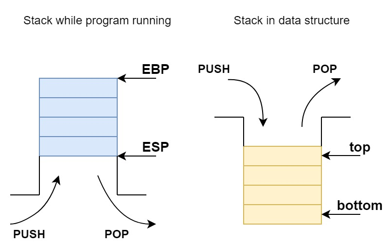
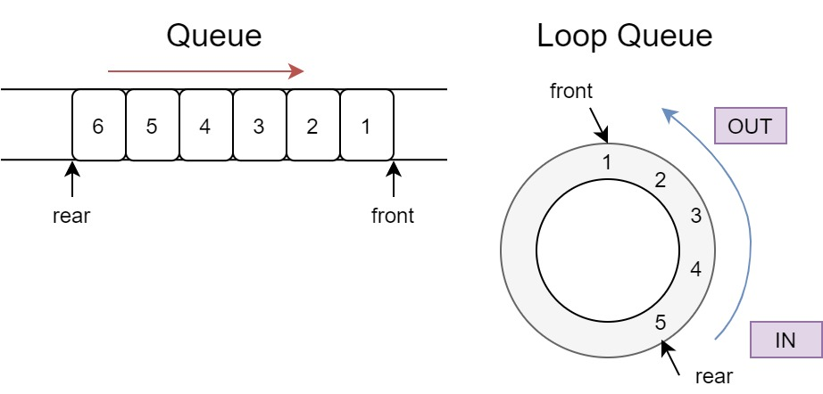

# Stack & Queue

# Stack ADT

​	The stack is like a buket, the first one is deep down the bottom, the last one is on the top.
​	This structure constrain the insert and delete operate only effect on the top of the stack, an it's linear structure.



## ADT

- Data
  - 0 or multi data element constitute the linear sequence $(a_0, a_1 , … , a_{n-1})$, they’re one to one relationed
- Algorithm
  - `create(s,max_size)`: Init a Stack **s** with max capacity of **max_size**
  - `destroy(s)`: realse the stack **s** storage space
  - `is_empty(s)`: check the stack is empty
  - `is_full(s)`: check the stack is full
  - `top(s,x)`: get the top element in stack **s**,return it in **x**
  - `push(s,x)`: insert the element **x** to the top of **s**
  - `pop(s)`: pop out the top element in **s**
  - `clear(s)`: wipe out the data in stack **s**, but not delete data

## sequence stack

it's easy to define the data structure

```c
typedef struct stack
{
    int top;
    int max_size;
    element_type *element;
};
```

the **top** is top element in stack, which can be see as $a_i$

### create

`create(s,max_size)`

Init a Stack **s** with max capacity of **max_size**

```c
status stack_create(stack *s, int max_size){
    s->max_size = max_size;
    s->top = -1; //not a_0, but defore a_0
    s->element = (element_type*)malloc(max_size*sizeof(element_type));
    if(!s->element)
        return ERROR;
    return OK;
}
```

### destroy

`destroy(s)`

realse the stack **s** storage space

```c
status stack_destroy(stack *s){
    s->max_size = 0;
    s->top = -1;
    free(s->element);
    s->element = 0;
    return OK;
}
```

### top

`top(s,x)`

get the top element in stack **s**,return it in **x**

```c
status top(stack *s,  element_type *x){
    if(is_empty)
        return ERROR;
    *x = s->element[s->top];
    return OK;
}
```

### push

`push(s,x)`

insert the element **x** to the top of **s**

```c
status push(stack *s, element_type x){
    if (is_full(s))
        return ERROR;
    s->element[s->top++] = x;
    return OK;
}
```

### pop

`pop(s)`

pop out the top element in **s**

```c
status pop(stack *s){
    if(is_empty(s))
        return ERROR;
    s->element[s->top] = (element_type)0;
    s->top--;
    return OK;
}
```

### clear

`clear(s)`

wipe out the data in stack **s**, but not delete data

```c
void stack_clear(stack *s){
    s->top=-1;
}
```

### Test

```c
#include <stdio.h>
#include <stdlib.h>
#include <ADT/stack.h>

int main(){
    stack *s = (stack *)malloc(sizeof(stack));
    stack_create(s,10);
    for (size_t i = 0; i < 10; i++)
        push(s,i);
    for (size_t i = 0; i < 5; i++)
    {
        printf("**loop No.%d\n",i);
        for (size_t j = 0; j < s->top; j++)
            printf("-------No.%d is %d\n",j,s->element[j]);
        pop(s);
    }
    stack_clear(s);
    printf("elements number: %d\n",s->top);
    stack_destroy(s);
    return 0;
}
```

# Queue ADT

​	The queue must insert at the tail, delete at the head, it's FIFO(First In First Out)
​	The tail is called "rear", The head is called "front"



## ADT

- Data
  - 0 or multi data element constitute the linear sequence $(a_0, a_1 , … , a_{n-1})$, they’re one to one relationed
  - the max length sets to max_size
- Algorithm
  - `create(q,max_size)`: Init a Queue **q** with max capacity of **max_size**
  - `destroy(q)`: realse the stack **q** storage space allocated
  - `is_empty(q)`: check the queue is empty
  - `is_full(q)`: check the queue is full
  - `front(q,x)`: get the head element in queue **q**,return it in **x**
  - `en_queue(q,x)`: insert the element **x** to the end of **q**
  - `de_queue(q)`: delete element in **q**
  - `clear(q)`: wipe out the data in queue **q**, but not delete data

## sequence queue

​	refer to the figuration up here, we can define the struct like

```c
typedef struct queue
{
    int front;
    int rear;
    int max_size;
    element_type *element;
}queue;
```


​	There's a phenomenon called "fake overflow",we need to use the loop queue. if this continued the `rear` pointer will get beyond `front` pointer.At this time we need to `front=(front+1)%max_size`;`rear=(rear+1)%max_size`

​	if `rear == front`, the queue is an empty queue

### create

`create(q,max_size)`

Init a Queue **q** with max capacity of **max_size**

```c
void q_create(queue *q, int max_size){
    q->max_size = max_size;
    q->element = (element_type *)malloc(max_size*sizeof(element_type));
    memset(q->element,0,q->max_size*sizeof(element_type));
    q->front = q->rear = 0;
}
```

### destroy

`destroy(q)`

realse the stack **q** storage space allocated

```c
void q_destroy(queue *q){
    q->max_size=0;
    free(q->element);
    q->front=q->rear=-1;
}
```

### is_empty & is_full

```c
status q_is_empty(queue *q){
    return q->front == q->rear;
}

status q_is_full(queue *q){
    return (q->rear+1)%q->max_size==q->front;
}
```

### front

`front(q,x)`

get the head element in queue **q**,return it in **x**

```c
status q_front(queue *q, element_type *x){
    if(q_is_empty(q))
        return ERROR;
    *x = q->element[(q->front+1)%(q->max_size)];
    return OK;
}
```

### en_queue

`en_queue(q,x)`

insert the element **x** to the end of **q**

```c
status q_en_queue(queue *q, element_type x){
    if(q_is_full(q))
        return ERROR;
    q->rear=(q->rear+1)%q->max_size; //moving rear
    q->element[q->rear] = x;
    return OK;
}
```

### de_queue

`de_queue(q)`

delete element in **q**

```c
status q_de_queue(queue *q){
    if(q_is_empty(q))
        return ERROR;
    q->front=(q->front+1)%q->max_size;
    return OK;
}
```

### clear

`clear(q)`

wipe out the data in queue **q**, but not delete data

```c
void q_clear(queue *q){
    q->front = q->rear = 0;
}
```

### main

test program

```c
#include <stdlib.h>
#include <stdio.h>
#include <ADT/queue.h>

int main()
{
    queue *Q = (queue*)malloc(sizeof(queue));
    q_create(Q,11);
    for (int i = 0; i < 20; i++)
        q_en_queue(Q,i+1);
    for (int i = 0; i < 10; i++)
        printf("%d ",Q->element[i]);
    printf("\n");
    for (int i = 10; i > 0; i--)
    {
        printf("**Round : %d\n",10-i);
        for (int j = 0; j <i; j++)
            printf("-------No.%d is %d\n", j, Q->element[j+1]);
        q_de_queue(Q);
    }
    return 0;
    
}
```

# Expression calculate

​	The expression constitute with operate number, operate symbol and delimiter.According to different put in sequence, it can divided to three expressions: infix expression($a+b;$), prefix expression($+ab;$), postfix expression($ab+;$),we'll use the stack structure to calculate postfix expression.

## postfix expression calculate

The mainly algorithm about this method is:

- scan the expression left to right
- if it's an operate number, push it into stack
- if it's an operate symbol, pop two element in stack and calculated it with this operate symbol, and push it into stack

here is a demo: the neighbored operate number separate with space, just like `23.5 12.3-2.6*`, and only supported `+-*/^`

- main function read postfix expression
- using `is_legal` check the invaild character in expression
- if it's valid, using `calculating` to evaluate the expression
- `get_item` to catch the element,if it's operate symbol, call `do_calc` to evaluate

### is_legal

filter the character but `0~9 +-*/.^`

```c
status is_legal(char *postfix)
{
    for (int i = 0; i < strlen(postfix); i++)
    {
        char c = postfix[i];
        if( !((c>='0'&&c<='9') || c=='.' || c=='+' || c=='-'|| 
                         c=='*'|| c=='/'|| c=='^'))
            return ERROR;
        return OK;
    }
}
```

### get_item

`cur_pos`: get the current element then plus one.
abnormal return -1, is number return 0, is operator return 1

```c
status get_item(char *postfix, int *cur_pos, char *item)
{
    int i = 0, k=*cur_pos;
    status flag;
    if(postfix[k]=='.') //the first number can not be .
        flag = ABNORMAL;
    else if(postfix[k]>='0' && postfix[k]<='9') //curren is number, next must be operator or number
    {
        while ( (postfix[k]>='0' && postfix[k]<='9') || postfix[k]=='.')
            item[i++] = postfix[k++];
        item[i] = '\0';
        flag = ISNUM;
    }
    else    //is operator
    {
        item[0] = postfix[k++];
        item[1] = '\0';
        flag = ISOP;
    }
    while(postfix[k]==' ')//get the basic element
        k++;
    *cur_pos = k;
    return flag;
}
```

i think this could be much easlier if we using python
we can let the postfix expression like `25 16 - 4 * `
in python, pseudo-code be like:

```python
def get_item(exp):
    exp = exp.split(' ')
	for e in exp:
        if e.is_number(): do_sth()
        elif e in operator: do_sth()
        else: return_error()
```


### do_calc

this is the core function the `calculating` used

```c
void do_calc(stack *s, char op)
{
    double rvalue,lvalue;
    if(!top(s,&rvalue)) //pop right value
        exit(0);

    pop(s);

    if(!top(s,&lvalue)) //pop left value
        exit(0);
    pop(s);
    switch (op)
    {
    case '+':
        push(s,lvalue+rvalue);
        break;
    case '-':
        push(s,lvalue-rvalue);
        break;
    case '*':
        push(s,lvalue*rvalue);
        break;
    case '/':
        if(fabs(rvalue)==0){
            printf("can't divid 0\n");
            exit(0);
        }
        push(s,lvalue/rvalue);
        break;
    case '^':
        push(s,pow(lvalue,rvalue));
        break;
    default:
        break;
    }
    
}
```

### calculating

according to the `get_item` returned result

- is number: push into stack
- is op: calc
- other: get error

```c
element_type calculating(char *postfix)
{
    stack *s = (stack *)malloc(sizeof(stack));
    char item[max_item];    //store operator
    element_type data;
    status flag = ABNORMAL;
    int cur_pos = 0;

    while (postfix[cur_pos]==' ')   //filter space
        cur_pos++;

    stack_create(s,max_item); //creating stack
    while (cur_pos < strlen(postfix)) //start scanning
    {
        flag = get_item(postfix, &cur_pos, item);
        if(flag == ABNORMAL)
        {
            printf("abnormal: invalid element!\n");
            exit(0);
        }
        else if (flag == ISOP)
        {
            switch (item[0])
            {
            case '+':
            case '-':
            case '*':
            case '/':
            case '^':
                do_calc(s,item[0]);
                break;
            }
        }
        else //is number
        {
            data = atof(item);//return string to float
            push(s,data);
        }   
    }
    if(s->top == 0) //only got one element in stack
        top(s, &data);
    else{
        printf("abnoraml: have redundant operator!");
        exit(0);
    }
    stack_destroy(s);
    return data;
}
```

### main

```c
#include <stdio.h>
#include <ADT/stack.h>
int main()
{
    char postfix[postfix_size];
    printf("please input the postfix expression:\n");
    gets(postfix);
    if(!is_legal(postfix))
    {
        printf("abnormal: have invalid character in postfix\n");
        return ERROR;
    }
    //two decimal places
    printf("%s = %.2f\n",postfix,calculating(postfix));
    return 0;
}
```

##  infix to postfix

​	Even postfix expression is easy for computer to read,but not human is easy to.So we need transfer infix to postfix expression, then let computer calculated it.

- Init the stack, `#` standard for starting push into stack
- scan element from left to right
  - if it is number, output
  - if it is `)`, keep output till meet `(`
  - if it is operator or `(`, compare the pirority: InComming and in-stack
    - InComming and in-stack: output stack till InComming and in-stack
- after scanning, output the stack

About the ICP and ISP, we can set the value to compare it

| Operator | `#`  | `(`  | `* /` | `+ -` | `)`  |
| -------- | ---- | ---- | ----- | ----- | ---- |
| ICP      | 0    | 7    | 4     | 2     | 1    |
| ISP      | 0    | 1    | 5     | 3     | 7    |

It's easy to accomplished the program

# recursion

it's useful tools to write program,but in here

Omit.