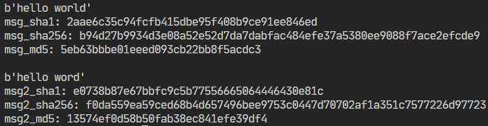
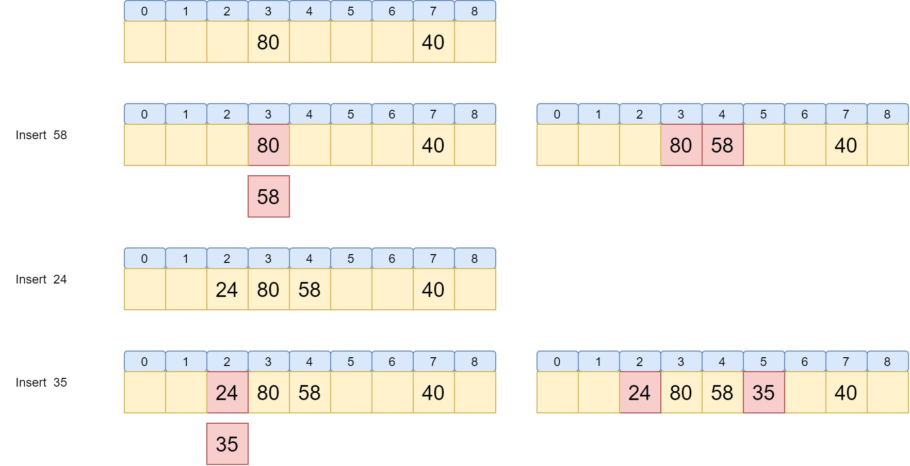
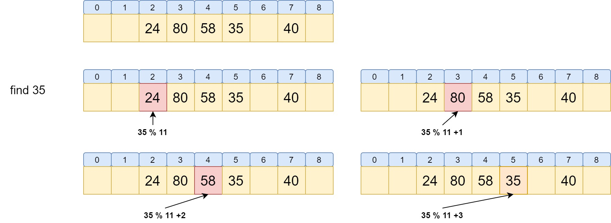

# Hash Table

# math magic

## introduction

​	In order to understanding what does a hash table mean in a intuitive way, using python here.
​	Here is using some cryptograph algorithm like  `sha` , `md5` and so on.It's basically the strict mathematical way to implenment a hash table algorithm.

```python
#coding=utf-8
#python3.8

from hashlib import sha1, sha256, md5
msg = b"hello world"
print(msg)
print("msg_sha1:",sha1(msg).hexdigest())
print("msg_sha256:",sha256(msg).hexdigest())
print("msg_md5:",md5(msg).hexdigest())
print()

msg2 = b"hello word"
print(msg2)
print("msg2_sha1:",sha1(msg2).hexdigest())
print("msg2_sha256:",sha256(msg2).hexdigest())
print("msg2_md5:",md5(msg2).hexdigest())
```

output



​	a slightly different in message caused large difference in results.
​	so, we can give an input and generate an output that likes the only tag related to this input. What hash table in data structure did is **mapping key to specific location**, its fast to find the data.

## hash function

A good hash function must could satisfy these two conditions:

- support fast calculating
- hash addresses evenly

We assume the hash table with length $M$, store the location from $0,M-1$.So hash function convert key to $0$  to $M$ int numbers.

1. remainder method

   $h(key)=key\ mod\ M$

   This method must choosen proper $M$.normally choosing the max prime number $P$ smaller than $M$,like

   $h(key)=key\ mod\ P$

2. Mid-square method

   $h(key)=\lfloor \frac{M}{W}(key^2\ mod\ W) \rfloor$

   and $W=2^w$ $M=2^k$, $W$ is computer's bit long and $M$ is hash table's length.

3. flooding method

   like separate $123456789$ to `123`,`456`,`789` and add them together

4. numeric analyz method

   normally used in circumstance already kown the distribution of key

# avoid collisions

## zipper method

if the diff element mapping into same location, set a link list in this location.

## linear probe method

while there is a collision, probe empty location with some certain sequence,then store the element caues collision to the first empty place found.

we have hash function $h(key)=key\ mod\ 11$

Insert would be like



Find would be like



but the similar hash element while causing Linear aggregation.

## ADT

- Data

  limited set to store element

- Algorithm

  `hash_create(ht, M)`: creating a hash table can store M elements

  `hash_destroy(ht)`: realse the `ht ` storage space

  `hash(key)`: according to hash function to find the hash value

  `search(key)`: according to linear probe method to search the element

  `insert(ht,key,element)`: according to linear probe method to insert the element

### hash_create

```c
void hash_create(hash_table *ht, int size){
    int i;
    ht->M=size;
    ht->num=0;
    ht->empty=(BOOL *)malloc(sizeof(BOOL)*size);
    ht->elements=(int *)malloc(sizeof(int)*size);
    for (i = 0; i < size; i++)
    {
        ht->empty[i]=true;
        ht->elements[i]=NU;
    }
}
```

### hash

```c
int hash(int key, int M){
    return key%M;
}
```

### hash_search

```c
int hash_search(hash_table *ht,int key){
    int anchor, pos;
    anchor=pos=hash(key,ht->M);
    pos=(pos+1)%ht->M;
    do{
        if(ht->empty[pos])
            return NOTPRESENT;
        if(ht->elements[pos]==key)
            return pos;
        pos=(pos+1)%ht->M;
    }while(pos!=anchor);
    return NOTPRESENT;
}
```

### hash_insert

```c
BOOL hash_insert(hash_table *ht, int key,){
    int anchor,i;
    if(hash_is_full(ht))
        return false;
    if(hash_search(ht,key)!=NOTPRESENT)
        return false;
    i=anchor=hash(ht->M, key);
    do{
        if(ht->elements[i]==NOTPRESENT) //current position can be used
        {
            ht->elements[i]=key;
            ht->empty[i]=false;
            ht->num++;
            return true;
        }
        i=(i+1)%ht->M;
    }while (i != anchor)
    return false;
}
```

### test function

```c
#include <ADT/hash.h>
#include <stdio.h>
#include <stdlib.h>
#include <time.h>

int main()
{
    hash_table *ht = (hash_table*)malloc(sizeof(hash_table));
    hash_create(ht,0x10);

    printf("--------------hash insert\n");
    int i,a;
    srand((unsigned)time(NULL));
    for (i = 0; i < 0x15; i++)
    {
        a = rand()%0x100;
        hash_insert(ht,a);
    }
    hash_output(ht);

    printf("--------------hash delete\n");
    int del_list[5];
    for (i = 0; i < 5; i++)
        del_list[i]=ht->elements[5+i];
    for (i = 0; i < 5; i++)
        hash_delete(ht,del_list[i]);
    hash_output(ht);

    printf("--------------hash insert again\n");
    for (i = 5; i < 10; i++)
    {
        a = rand()%0x100;
        hash_insert(ht,a);
    }
    hash_output(ht);

    return 0;
}
```

## other method

- secondary exploration

  $h_1(key),h_2(key)...h_{2i-1}(key),h_{2i}(key)$

  $h_{2i-1}(key)=(h(key)+i^2)\ mod\ M$

- double hash

  