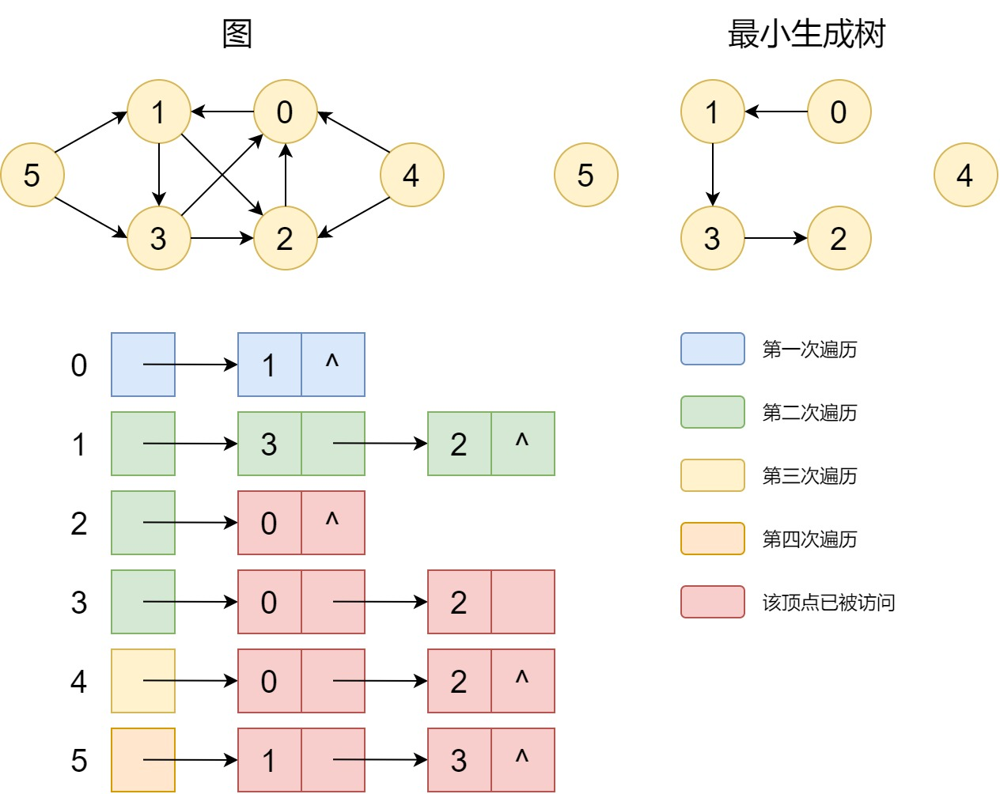

# Graph

> This chapter contains lots of definations and very complex concepts
>
> So this README file is in Chinese(my native laguage), there will be english version few months later

# 基本概念

1. 邻接：简单的说就是两个节点之间有连接
2. 度：入度+出度
   - 入度：指向该节点的连接数
   - 出度：从该节点出发的连接数
3. 路径：顶点序列，如 $(a,b);(b,c);(c,d)$，其中每一个边都在图$G$中
   - 路径长度：路径中边的个数
4. 自回路：允许有边$(a,a)$
5. 多重图：两顶点存在相同的重复的边
6. 连通图
   - 连通：从顶点A到顶点B，可以通过途中路径到达
   - 连通图：任意两个顶点均能连通
   - 连通分量：极大的连通子图的个数
   - 强连通图：顶点A到B和B到A都能够连通
   - 强连通分量：极大的强连通子图的个数
7. 生成树：**无向连通图G**的生成树是一个极小的连通子图，包括图中的所有顶点，和含有能够组成树的$n-1$条边
8. 权：对边进行赋值
9. 网：每条边都存在权

# ADT

## ADT

- data

  顶点的有限、非空集合$G$和边集合$V$，边中元素由偶对顶点表示，如$<u,v>$，$w$表示权值。元素之间的关系十多对多

- algorithm

  `g_init(G,n)`：创建含有 $n$ 个顶点的无边图 $G$

  `g_destroy(G)`：撤销一个图 $G$

  `g_exist(G,u,v)`：搜索边 $<u,v>$ 是否存在

  `g_insert(G,u,v,w)`：对图$G$中的边 $<u,v>$ 设置权值为$w$的边

  `remove(G,u,v)`：删除边

## 邻接矩阵表示法

假设有图$G$中有$n$个顶点，那么每个点最多就有$n$个边(包括自回路)。那么可以使用一个$n\times n$的矩阵表示，

**对于无向图**：矩阵中的一个元素为 $A[u][v]$ ，通过数值1表示存在 $(u,v)$ 或 $(v,u)$

**对于有向图**：矩阵中的一个元素为 $A[u][v]$ ，通过数值1表示存在 $<u,v>$

**对于带权无向图**

- $w(u,v)$ ： $(u,v)$ 或 $(v,u)$ 成立
- $0$ ： $u=v$ 成立
- $-1$ ： 其他

**对于带权有向图**

- $w(u,v)$：$<u,v>$成立
- $0$：$u=v$成立
- $-1$：其他

### 邻接矩阵实现

```c
typedef int element_type;

typedef struct m_graph
{
    element_type a[][];     //matrix
    int n;
    int e;
    element_type no_edge;   //depend on taking the right or not
}m_graph;
```

### 初始化

```c
status mg_init(m_graph *mg, int n, element_type no_edge_value){
    int i, j;
    mg->n = n;
    mg->e = 0;
    mg->a = (element_type **)malloc(n*sizeof(element_type*));
    if (!mg->a)
        return ERROR;
    for(i=0; i<mg->n; i++)
    {
        mg->a[i] = malloc(n*sizeof(element_type));
        for ( j = 0; j < mg->n; j++)
            mg->a[i][j] = mg->no_edge;
        mg->a[i][i] = 0;
    }
    return OK;
}
```

### 撤销

```c
void mg_destroy(m_graph *mg){
    int i;
    for (i = 0; i < mg->n; i++)
        free(mg->a[i]);
    free(mg->a);
}
```

### 存在

```c
status mg_exist(m_graph *mg, int u, int v){
    if(u<0 || v<0 || u>mg->n-1 || v>mg->n-1 || u==v || mg->a[u][v] == mg->no_edge)
        return ERROR;
    return OK;
}
```

### 插入

```c
status mg_insert(m_graph *mg, int u, int v, element_type w){
    if(u<0 || v<0 || u>mg->n-1 || v>mg->n-1 || u==v)
        return ERROR;
    if(mg->a[u][v]!=mg->no_edge)
        return DUPLICATE;
    mg->a[u][v] = w;
    mg->e++;
    return OK;
}
```

### 删除

```c
status remove(m_graph *mg, int u, int v){
    if(u<0 || v<0 || u>mg->n-1 || v>mg->n-1 || u==v)
        return ERROR;
    if(mg->a[u][v] == mg->no_edge)
        return NOTPRESENT;
    mg->a[u][v] = mg->no_edge;
    mg->e--;
    return OK;
}
```

基本上就是之前的多维数组管理

## 邻接表表示法


### 邻接表实现

```c
typedef struct e_node
{
    int adjvex;
    element_type w;
    struct e_node *next_arc;    
}e_node;

typedef struct l_graph
{
    int n;
    int e;
    e_node **a;
}l_graph;
```

### 初始化

```c
status lg_init(l_graph *lg, int size){
    int i;
    lg->n = size;
    lg->e = 0;
    lg->a = (e_node **)malloc(size*sizeof(e_node *));
    if(!lg->a)
        return ERROR;
    else
    {
        for (i = 0; i < lg->n; i++)
            lg->a[i] = NULL;
        return OK;
    }
}
```

### 撤销

```c
void lg_destroy(l_graph *lg){
    int i;
    e_node *p, *q;
    for (i = 0; i < lg->n; i++)
    {
        p = lg->a[i];
        q = p;
        while(p)
        {
            p = p->next_arc;
            free(q);
            q = p;
        }
    }
    free(lg->a);
}
```

### 搜索

```c
status lg_exist(l_graph *lg, int u, int v){
    e_node *p;
    if(u<0 || v<0 || u>lg->n-1 || v>lg->n-1 || u==v)
        return ERROR;
    p = lg->a[u];
    while(p && p->adjvex!=v)
        p = p->next_arc;
    if(!p)
        return ERROR;
    else
        return OK;
}
```

### 插入

```c
status lg_insert(l_graph *lg, int u, int v, element_type w){
    e_node *p;
    if(u<0 || v<0 || u>lg->n-1 || v>lg->n-1 || u==v)
        return ERROR;
    if(lg_exist(lg, u, v))
        return DUPLICATE;
    p = (e_node *)malloc(sizeof(e_node));
    p->adjvex = v;
    p->w = w;
    p->next_arc = lg->a[u];
    lg->a[u] = p;
    lg->e++;
    return OK;
}
```

### 删除

```c
status lg_delete(l_graph *lg, int u, int v){
    e_node *p, *q;
    if(u<0 || v<0 || u>lg->n-1 || v>lg->n-1 || u==v)
        return ERROR;
    p = lg->a[u], q=NULL;
    while(p &&p->adjvex!=v)
    {
        q=p;
        p=p->next_arc;
    }
    if(!p)
        return NOTPRESENT;
    if(q)
        q->next_arc = p->next_arc;
    else    
        lg->a[u] = p->next_arc;
    free(p);
    lg->e--;
    return OK;
}
```

算法基本上即使在管理多个链表构成的数列

## 遍历

### 深度优先(Depth First Search)

类似于树中的遍历


一种递归实现

```c
void lg_dfs(l_graph *lg, int visted[], int v){
    e_node *w;
    printf("%d ",v);
    visted[v] = 1;
    for ( w = lg->a[v]; w; w=w->next_arc)//get marked
        if(!visted[w->adjvex])
            lg_dfs(lg,visted,w->adjvex);
}
```

```c
void dfs_graph(l_graph *lg){
    int i;
    int *visted =(int *)malloc(sizeof(int)*lg->n);
    for (i = 0; i < lg->n; i++)//init visted array
        visted[i]=0;
    for (i = 0; i < lg->n; i++)
        if(!visted[i])
            lg_dfs(lg, visted, i);
    free(visted);    
}
```

由于每个节点仅被访问一次，设定点数为 $n$ ，边数为 $e$，

- 使用邻接表表示时间复杂度 $O(n+e)$
- 使用邻接矩阵表示时间复杂度 $O(n^2)$

### 宽度优先(Breadth First Search)

类似于树的层次遍历



```c
void lg_bfs(l_graph *lg, int visted[], int v){
    e_node *w;
    queue q;
    q_create(&q,lg->n);
    visted[v]=1;
    printf("%d ",v);
    q_en_queue(&q,v);
    while(q_is_empty(&q))
    {
        q_front(&q,&v);
        q_de_queue(&q);
        for (w = lg->a[v]; w; w=w->next_arc)
        {
            if(!visted[w->adjvex])  //not visted
            {
                visted[w->adjvex] = 1;
                printf("%d ",w->adjvex);
                q_en_queue(&q, w->adjvex);
            }
        }
    }
}

void bfs_graph(l_graph *lg){
    int i;
    int *visted = (int *)malloc(sizeof(int)*lg->n);
    for (i = 0; i < g->n; i++)
        visted[i] = 0;
    for (i = 0; i < g->n; i++)
        if(!visted[i])
            lg_bfs(lg,visted,i);
    free(visted);
}
```

这里的`queue`起到了同时访问的作用

设定点数为 $n$ ，边数为 $e$，

- 使用邻接表表示时间复杂度 $O(n+e)$
- 使用邻接矩阵表示时间复杂度 $O(n^2)$

## 测试

```c
#include <stdio.h>
#include <stdlib.h>
#include <ADT/graph.h>

int main()
{
    m_graph *mg = (m_graph *)malloc(sizeof(m_graph));
    mg_init(mg, 6, -1);
    mg_insert(mg,0,1,0);
    mg_insert(mg,1,3,0);
    mg_insert(mg,1,2,0);
    mg_insert(mg,2,0,0);
    mg_insert(mg,3,0,0);
    mg_insert(mg,3,2,0);
    mg_insert(mg,4,0,0);
    mg_insert(mg,4,2,0);
    mg_insert(mg,5,1,0);
    mg_insert(mg,5,3,0);
    int i,j;
    for (i = 0; i < mg->n; i++){
        for (j = 0; j < mg->n; j++)
            printf("%d ",mg->a[i][j]);
        printf("\n");
    }
    mg_destroy(mg);
    free(mg);

    //--------------------------------------
    l_graph *lg = (l_graph *)malloc(sizeof(l_graph));
    lg_init(lg,6);
    lg_insert(lg,0,1,0);
    lg_insert(lg,1,3,0);
    lg_insert(lg,1,2,0);
    lg_insert(lg,2,0,0);
    lg_insert(lg,3,0,0);
    lg_insert(lg,3,2,0);
    lg_insert(lg,4,0,0);
    lg_insert(lg,4,2,0);
    lg_insert(lg,5,1,0);
    lg_insert(lg,5,3,0);
    
    printf("\nDFS>\n");
    dfs_graph(lg);
    printf("\nBFS>\n");
    bfs_graph(lg);
    lg_destroy(lg);
    free(lg);
    return 0;
}
```

输出

```c
0 0 -1 -1 -1 -1 
-1 0 0 0 -1 -1  
0 -1 0 -1 -1 -1 
0 -1 0 0 -1 -1  
0 -1 0 -1 0 -1  
-1 0 -1 0 -1 0  

DFS>
0 1 2 3 4 5     
BFS>
0 1 2 3 4 5
```

# 拓扑序列

AOV网(Active On Vertex network)：是一个有向无环图

## 拓扑排序

1. 从图中选择一个输入度为0的顶点开始并输出
2. 删除该顶点及其出边
3. 重复1.2.直到不存在入度为0的点

求出所有顶点入度

```c
void lg_degree(l_graph *lg, int in_degree){
    int i;
    e_node *p;
    for (i = 0; i < lg->n; i++)
    in_degree[i] = 0;
    for (i = 0; i < g->n; i++)
        for(p = lg->a[i]; p; p = p->next_arc)
            in_degree[p->adjvex]++;
}
```

然后将入度为0的顶点存入栈中，顶点邻接顶点入度减一

```c
status lg_top_sort(l_graph *lg, int *topo){
    int i,j,k;
    e_node *p;
    stack s;
    stack_create(&s,lg->n);
    int *in_degree = (int *)malloc(sizeof(int)*lg->n);
    lg_degree(lg, in_degree);
    for(i=0; i<lg->n; i++)
        if(!in_degree[i])
            push(&s,i);
    for(i=0; i<lg->n; i++)
    {
        if(stack_is_empty(&s))
            return ERROR;
        else
        {
            top(&s,&j);
            pop(&s);
            topo[i] = j;
            printf("%d ",j);
            for(p=lg->a[j]; p; p=p->next_arc)   //change the neibor
            {
                k=p->adjvex;
                in_degree[k]--;
                if(!in_degree[k])
                    push(&s,k);
            }
        }
        
    }
    return OK;
}
```

## 关键路径


 在 $(start,end)$ 内完成 $x$ 小时的事件，最早从 $start$ 开始，最迟从 $end-x$ 开始

对于事件

|                  | $V_0$ | $V_1$ | $V_2$ | $V_3$ | $V_4$ | $V_5$ | $V_6$ | $V_7$ | $V_8$ |
| ---------------- | ----- | ----- | ----- | ----- | ----- | ----- | ----- | ----- | ----- |
| $E_{early(v_i)}$ | 0     | 6     | 4     | 5     | 7     | 7     | 16    | 15    | 19    |
| $E_{late(v_i)}$  | 0     | 6     | 6     | 9     | 7     | 11    | 17    | 15    | 19    |

$E_{early(v_i)}=E_{v_{i-1}}+max\{<V_{i-1},V_i>\}$，可以理解为从开始到当前顶点的最大路径

$E_{late(v_i)}=E_{early(n)}-max\{<V_i,V_n>\}$，可以理解为从开始到当前顶点的最大路径减去从当前到终点的最大路径，及距离开始最迟发生路径

对于活动

|                  | $A_0$ | $A_1$ | $A_2$ | $A_3$ | $A_4$ | $A_5$ | $A_6$ | $A_7$ | $A_8$ | $A_9$ | $A_{10}$ | $A_{11}$ |
| ---------------- | ----- | ----- | ----- | ----- | ----- | ----- | ----- | ----- | ----- | ----- | -------- | -------- |
| $A_{early(a_i)}$ | 0     | 0     | 0     | 6     | 4     | 5     | 7     | 7     | 7     | 16    | 15       | 7        |
| $A_{late(a_i)}$  | 0     | 2     | 4     | 6     | 6     | 9     | 8     | 7     | 11    | 17    | 15       | 18       |
| 关键路径         | √     |       |       | √     |       |       |       | √     |       |       | √        |          |

设活动 $a_k$ 关联的边为 $<v_i,v_j>$，则

$A_{early(a_k)}=E_{early(v_i)}$：活动最早可能发生时间

$A_{late(a_k)}=E_{late(v_j)}-weight<v_i,v_j>$：活动最晚发生时间

若二者相等，则为关键路径，连起来就是事件发生完全至少要花多少事件

1. event_early函数，顺拓扑序

```c
void event_early(l_graph *lg, int *e_early, int *topo)
{
    int i,k;
    e_node *p;
    for(i=0; i<lg->n; i++)  //init event early array
        e_early[i] = 0;
    for(i=0; i<lg->n; i++)
    {
        k = topo[i];
        for(p = lg->A[k]; p; p=p->next_arc)
        {
            if(e_early[p->adjvex] < e_early[k] + p->w)
                e_early[p->adjvex] = e_early[k] + p->w;
        }
    }
}
```

2. event_late函数，逆拓扑序

```c
void event_late(l_graph *lg, int *e_early, int *topo, int max){
    int i,k;
    e_node *p;
    for(i=0; i<lg->n; i++)  //init event late array
        e_early[i] = max;
    for(i=lg->n-2; i>-1; i--)
    {
        k = topo[i];
        for(p = lg->A[k]; p; p=p->next_arc)
        {
            if(e_early[p->adjvex] > e_early[k] - p->w)
                e_early[p->adjvex] = e_early[k] - p->w;
        }
    }    
}
```

3. active_early

```c
void active_early(l_graph *lg, int *a_early, int *e_early, int *topo){
    int i,k;
    e_node *p;
    for(i=0; i<lg->n; i++)  //init activity late array
        a_early[i] = 0;
    for(i=0; i<lg->n; i++)
    {
        k = topo[i];
        for (p = lg->a[k]; p; p=p->next_arc)
        {
            if(p->adjvex == k)
                a_early[p->next_arc->adjvex] = e_early[p->adjvex];
        }
        
    }
}
```

4. active_late

```c
void active_late(l_graph *lg, int *a_late, int *e_late, int *topo, int max){
    int i,k;
    e_node *p;
    for(i=0; i<lg->n; i++)  //init activity late array
        a_early[i] = max;
    for(i=lg->n-2; i>-1; i--)
    {
        k = topo[i];
        for (p = lg->a[k]; p; p=p->next_arc)
        {
            if(p->adjvex == k)
                a_early[p->next_arc->adjvex] = e_late[p->adjvex]-p->w;
        }
        
    }    
}
```


