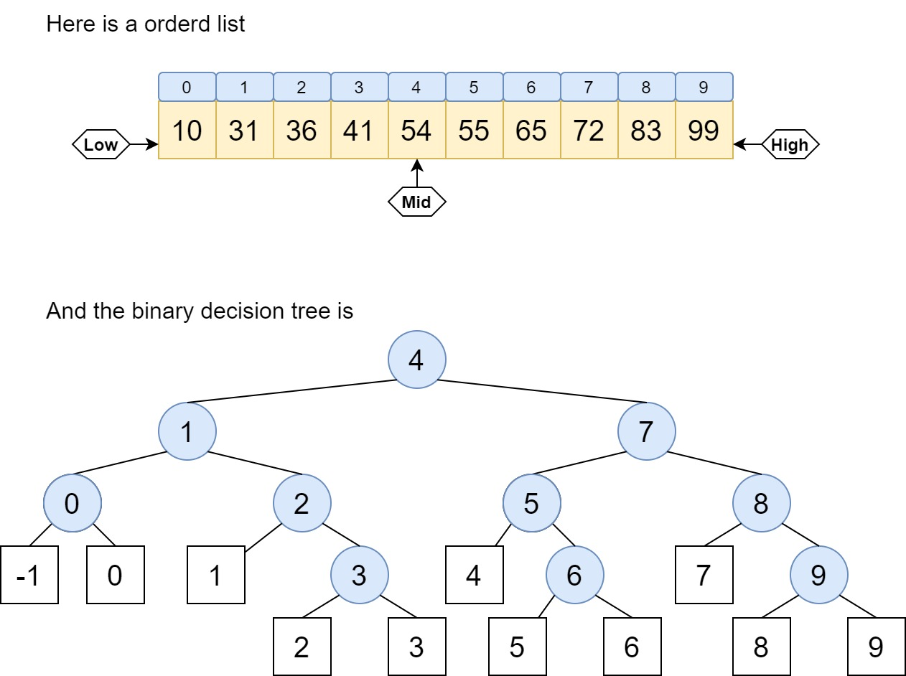

# Sets

# Conceptions

1. **Set** 

   > A **set** is the mathematical model for a collection of different things; a set contains elements or *members*, which can be mathematical objects of any kind: numbers, symbols, points in space, lines, other geometrical shapes, variables, or even other sets.The set with no element is the empty set; a set with a single element is a singleton. A set may have a finite number of elements or be an infinite set. Two sets are equal if they have precisely the same elements.

   - **multiset**: The collectionof the unsequence element set. The element in set can be shown multiple times like $\{0,1,1,2,3\}$
   - **ordered set**: the element in set must in a certain order list and can only shown in once, like $(1,2,3,6,7,8)$

2. **dynamic set**

   Set as a data structure, just collection the same type element and each element don't have any connection excepte they're in the same set. The dynamic set allows the actions like insert and delete element, so the element in set is dynamical.

3. **key**

   The key in data structure is like the tag of a certain group of elements, we can reach the element though the tag(or key).If the key is mapping only one element, we called this key the **main_key**. If the key is mapping into a group of elements, we called this **vice_key**

4. **search**

   Accoring to the value we kown, we search the set to find the element value equal to the value we've kown, and return the element in set or address of the element in set. If we don't found any element, return failed.

   - **kind of serach**

   1. **Static search**: just search, don't move element, don't change the set
   2. **dynamic search**: while the searching, changing the element in set

5. **Average Search Length(ASL)**

   In search algorithm, count the average times to get the searched value is ASL. It can jugde the efficiency of the algorithm.

# Dynamic Set

## ADT

- Data

  the collection of different value and same type element, the element is tag with key, the max length allowed is `max_len`

- Algorithm

  `set_init(set)`: initial an empty set

  `set_destroy(set)`:retreat the set

  `set_search(x)`: search the element in set which value equal to x

  `set_insert(x)`: If the value x is in set, return duplicate; if the set is fulled, return overflow; else insert the x return succed

  `set_remove(x)`: If the element value's x is in set, remove the element return succed; else return 404

we can using the linear table to express the set

```c
typedef struct listset
{
    int n;
    int max_len;
    element_type *element;
}listset;
```

# Search Algorithm

most of the method mentioned here is pretty ez.

here I only noted the **binary decision tree**

The binary decision tree is for the **ordered list**, because it's oredered, so we can implement a binary tree(similar to heap) to sorted the data's index or keys.



if the result is in squre, it means don't found the value.