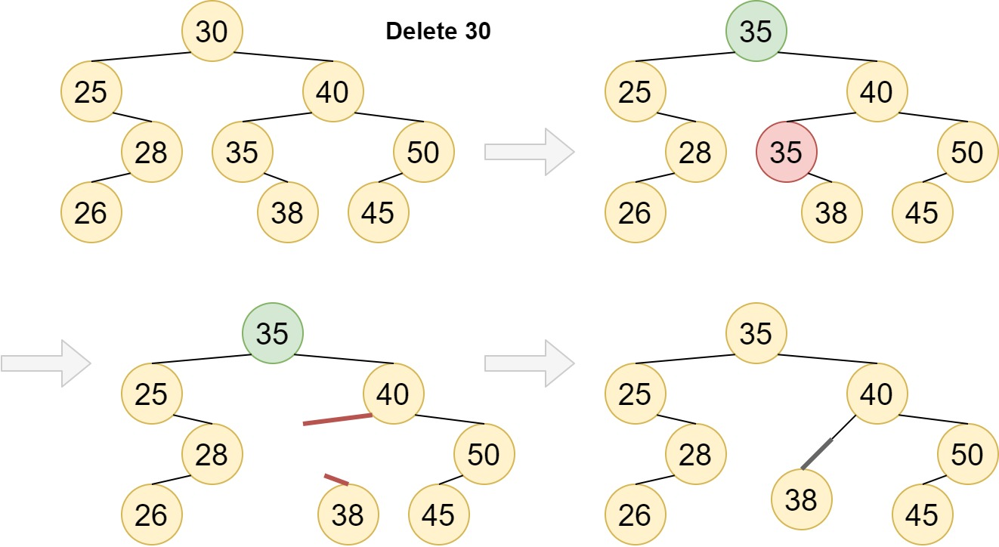
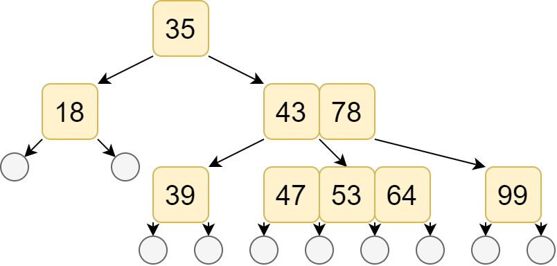

# Binary Search Tree

## definitions

**1.properties**

- The any two nodes in tree is not have the same value
- If left tree isn't empty, the every node's value in left tree is smaller in root's value
- If right tree isn't empty, the every node's value in right tree is bigger in root's value

**important**

- If we traverse a binary serach tree in **LVR**, we'll get a descending sequence. The binary search tree is so called as binary sort tree

**2.data structure**

```c
typedef int key_type;
typedef int element_type;

typedef struct entry
{
    key_type key;
    element_type data;
}entry;

typedef struct bst_node
{
    entry element;
    struct bst_node *l_child;
    struct bst_node *r_child;
}bst_node, *Pbst_node;
```

here we storage a dynamic element type `entry`, just like mentioned in last chapter set.

## algorithm

### search

it's not difficult to implement this method. Because the definition is recursive, so it easily write it in recursive.

```c
bst bst_rec_search(bst t, key_type k){
    if(!t)
        return ERROR;
    else if(t->element.key == k)
        return t;
    else if(t->element.key > k)
        return bst_rec_search(t->l_child);
    else
        return bst_rec_search(t->r_child);
}
```

and thank to the properties of bst, it's also easy to implement iteratly

```c
bst bst_itr_search(bst t, key_type k){
    while(t)
    {
        if(t->element.key > k)
            t = t->l_child;
        else if(t->element.key < k)
            t = t->r_child;
        else
            return t;
    }
    return ERROR;
}
```

### insert

According to the properties,if we insert element `e`

1. `e` is differenr from any element in current bst
2. if `e` is smaller than root, inseted it into left tree
3. if `e` is bigger than root, inseted it into right tree

```c
BOOL bst_insert(bst *t, entry e){
    bst_node *p=t, *q, *r;
    key_type = e.key;
    while(p)    //check the same,and set `q` to the proper position
    {
        q = p;
        if(p->element.key > k)
            p=p->l_child;
        else if(p->element.key < k)
            p=p->r_child;
        else{
            printf("Duplicate\n");
            return ERROR;
        }
    }
    r = (bst)malloc(sizeof(bst_node)); //create node
    r->element = e; r->l_child=NULL; r->r_child=NULL;
    //start insert
    if(!t)
        t=r;                        //root node
    else if(t->element.key > k)
        q->l_child = r;
    else if(t->element.key < k)
        q->r_child = r;
    return true;
}
```

### delete

I think this part is one of the most difficult in this chapter.Although it's apprently easy to delete the leaf and the single child node, it's hard to delete the node have both child.



The key in here is, found the smallest node in right tree or biggest in left tree.These tree must leaf node or the node have only one child, so the problem can be transmitted to these node

Here we take example using the smallest node in right tree, it's **node_35**. And we want to delete **node_30**

1. set the **node_30** to **node_35**
2. delete original **node_35**, because it's  leaf node or the node have only one child, so we can easily set the parent node and child node, Here **node_40**'s left child becoming **node_38**

```c
BOOL dst_delete(bst *t, key_type k)
{
    bst_node *c, *r, *s, *p = t, *q;
    //1.check if the node exists
    while(p && p->element.key != k)
    {
        q = p; //set `q` to the proper position
        if(p->element.key > k)
            p = p->l_child;
        else
            p = p->r_child;
    }
    if(!p)
    {
        printf("Duplicated!\n");
        return ERROR;
    }
    //2.if p have both child
    if(p->l_child && p->r_child)
    {
        s=p->r_child;
        r=p;
        //find p's LVR back node `s`
        while(s->l_child)
        {
            r=s;
            s=s->l_child;
        }
        //[!]-- copy `s` to `p` --[!]
        p->element = s->element;
        p = s; q = r;
    }   //now `q` is parent of `p`
    //3. let `c` to replace `p`
    if(p->l_child)
        c = p->l_child;
    else
        c = p->r_child;
    //4. replacement
    if(p==t)                //if delete root
        t=c;
    else if(p==q->l_child)  //`c` replace `p`
        q->l_child = c;
    else if(p==q->r_child)
        q->r_child = c;
    free(p);
    return true;   
}
```

# Adelson-Velsky and Landis Tree

## definitions

​	In binary search tree has a problem: if we insert a sequence like $\{20,30,40,50,60,70\}$ into bst, the deepth of the bst is $6$, apparently it's not convient our algorithm. This situation called "degenerate". If we using this bst, the time complexity is $O(n)$. But if we adjust it a little bit, we'll get some new tree like AVL tree(binary balanced tree) , red black tree ...

​	The different is AVL tree and bst is AVL tree's left and right child deepth with one absolute difference.If we define a balancing-factor is left tree hight minus right tree hight, is value must $-1,0,1$.

## adjustment

the ususal way to adjust AVL tree has two:

1. single rotation
2. double rotation

and facing 4 situations

1. LL: insert into left child's left tree
2. RR: insert into right child's right tree
3. LR: insert into left child's right tree
4. RL: insert into right child's left tree

The detailed is willed explained on wiki-pedia, so won'be recited here.

# m-ary search tree

​	If we want to search lots of data outside of inside storage, we must read data outside, But I/O operations will consume efficiency.Using binart search tree or AVL only storage two element infomation at a node,what if we set more interval so onr single node can storage more infomation.



If we want to find **53** 

1. started from root, $53 \gt 35$, go into right tree
2. $43 \lt 53 \lt 78$, go into middle tree
3. found  **53**


# reference 

https://en.wikipedia.org/wiki/M-ary_tree

